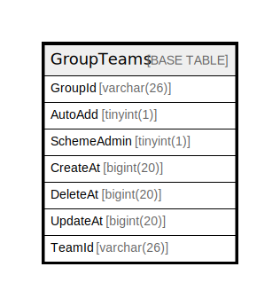

# GroupTeams

## 概要

<details>
<summary><strong>テーブル定義</strong></summary>

```sql
CREATE TABLE `GroupTeams` (
  `GroupId` varchar(26) NOT NULL,
  `AutoAdd` tinyint(1) DEFAULT NULL,
  `SchemeAdmin` tinyint(1) DEFAULT NULL,
  `CreateAt` bigint(20) DEFAULT NULL,
  `DeleteAt` bigint(20) DEFAULT NULL,
  `UpdateAt` bigint(20) DEFAULT NULL,
  `TeamId` varchar(26) NOT NULL,
  PRIMARY KEY (`GroupId`,`TeamId`),
  KEY `idx_groupteams_schemeadmin` (`SchemeAdmin`),
  KEY `idx_groupteams_teamid` (`TeamId`)
) ENGINE=InnoDB DEFAULT CHARSET=utf8mb4
```

</details>

## カラム一覧

| 名前          | タイプ         | デフォルト値       | NULL許可   | 子テーブル      | 親テーブル      | コメント     |
| ----------- | ----------- | ------------ | -------- | ---------- | ---------- | -------- |
| GroupId     | varchar(26) |              | false    |            |            |          |
| AutoAdd     | tinyint(1)  | NULL         | true     |            |            |          |
| SchemeAdmin | tinyint(1)  | NULL         | true     |            |            |          |
| CreateAt    | bigint(20)  | NULL         | true     |            |            |          |
| DeleteAt    | bigint(20)  | NULL         | true     |            |            |          |
| UpdateAt    | bigint(20)  | NULL         | true     |            |            |          |
| TeamId      | varchar(26) |              | false    |            |            |          |

## 制約一覧

| 名前      | タイプ         | 定義                            |
| ------- | ----------- | ----------------------------- |
| PRIMARY | PRIMARY KEY | PRIMARY KEY (GroupId, TeamId) |

## INDEX一覧

| 名前                         | 定義                                                       |
| -------------------------- | -------------------------------------------------------- |
| idx_groupteams_schemeadmin | KEY idx_groupteams_schemeadmin (SchemeAdmin) USING BTREE |
| idx_groupteams_teamid      | KEY idx_groupteams_teamid (TeamId) USING BTREE           |
| PRIMARY                    | PRIMARY KEY (GroupId, TeamId) USING BTREE                |

## ER図



---

> Generated by [tbls](https://github.com/k1LoW/tbls)
