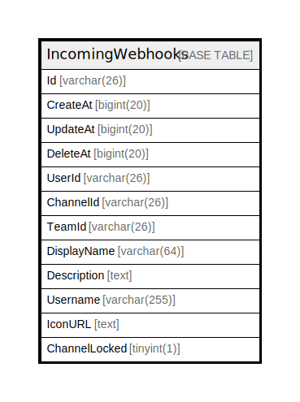

# IncomingWebhooks

## 概要

<details>
<summary><strong>テーブル定義</strong></summary>

```sql
CREATE TABLE `IncomingWebhooks` (
  `Id` varchar(26) NOT NULL,
  `CreateAt` bigint(20) DEFAULT NULL,
  `UpdateAt` bigint(20) DEFAULT NULL,
  `DeleteAt` bigint(20) DEFAULT NULL,
  `UserId` varchar(26) DEFAULT NULL,
  `ChannelId` varchar(26) DEFAULT NULL,
  `TeamId` varchar(26) DEFAULT NULL,
  `DisplayName` varchar(64) DEFAULT NULL,
  `Description` text DEFAULT NULL,
  `Username` varchar(255) DEFAULT NULL,
  `IconURL` text DEFAULT NULL,
  `ChannelLocked` tinyint(1) DEFAULT NULL,
  PRIMARY KEY (`Id`),
  KEY `idx_incoming_webhook_user_id` (`UserId`),
  KEY `idx_incoming_webhook_team_id` (`TeamId`),
  KEY `idx_incoming_webhook_update_at` (`UpdateAt`),
  KEY `idx_incoming_webhook_create_at` (`CreateAt`),
  KEY `idx_incoming_webhook_delete_at` (`DeleteAt`)
) ENGINE=InnoDB DEFAULT CHARSET=utf8mb4
```

</details>

## カラム一覧

| 名前            | タイプ          | デフォルト値       | NULL許可   | 子テーブル      | 親テーブル      | コメント     |
| ------------- | ------------ | ------------ | -------- | ---------- | ---------- | -------- |
| Id            | varchar(26)  |              | false    |            |            |          |
| CreateAt      | bigint(20)   | NULL         | true     |            |            |          |
| UpdateAt      | bigint(20)   | NULL         | true     |            |            |          |
| DeleteAt      | bigint(20)   | NULL         | true     |            |            |          |
| UserId        | varchar(26)  | NULL         | true     |            |            |          |
| ChannelId     | varchar(26)  | NULL         | true     |            |            |          |
| TeamId        | varchar(26)  | NULL         | true     |            |            |          |
| DisplayName   | varchar(64)  | NULL         | true     |            |            |          |
| Description   | text         | NULL         | true     |            |            |          |
| Username      | varchar(255) | NULL         | true     |            |            |          |
| IconURL       | text         | NULL         | true     |            |            |          |
| ChannelLocked | tinyint(1)   | NULL         | true     |            |            |          |

## 制約一覧

| 名前      | タイプ         | 定義               |
| ------- | ----------- | ---------------- |
| PRIMARY | PRIMARY KEY | PRIMARY KEY (Id) |

## INDEX一覧

| 名前                             | 定義                                                        |
| ------------------------------ | --------------------------------------------------------- |
| idx_incoming_webhook_create_at | KEY idx_incoming_webhook_create_at (CreateAt) USING BTREE |
| idx_incoming_webhook_delete_at | KEY idx_incoming_webhook_delete_at (DeleteAt) USING BTREE |
| idx_incoming_webhook_team_id   | KEY idx_incoming_webhook_team_id (TeamId) USING BTREE     |
| idx_incoming_webhook_update_at | KEY idx_incoming_webhook_update_at (UpdateAt) USING BTREE |
| idx_incoming_webhook_user_id   | KEY idx_incoming_webhook_user_id (UserId) USING BTREE     |
| PRIMARY                        | PRIMARY KEY (Id) USING BTREE                              |

## ER図



---

> Generated by [tbls](https://github.com/k1LoW/tbls)
