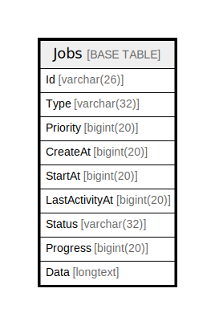

# Jobs

## 概要

<details>
<summary><strong>テーブル定義</strong></summary>

```sql
CREATE TABLE `Jobs` (
  `Id` varchar(26) NOT NULL,
  `Type` varchar(32) DEFAULT NULL,
  `Priority` bigint(20) DEFAULT NULL,
  `CreateAt` bigint(20) DEFAULT NULL,
  `StartAt` bigint(20) DEFAULT NULL,
  `LastActivityAt` bigint(20) DEFAULT NULL,
  `Status` varchar(32) DEFAULT NULL,
  `Progress` bigint(20) DEFAULT NULL,
  `Data` longtext CHARACTER SET utf8mb4 COLLATE utf8mb4_bin DEFAULT NULL CHECK (json_valid(`Data`)),
  PRIMARY KEY (`Id`),
  KEY `idx_jobs_type` (`Type`),
  KEY `idx_jobs_status_type` (`Status`,`Type`)
) ENGINE=InnoDB DEFAULT CHARSET=utf8mb4
```

</details>

## カラム一覧

| 名前             | タイプ         | デフォルト値       | NULL許可   | 子テーブル      | 親テーブル      | コメント     |
| -------------- | ----------- | ------------ | -------- | ---------- | ---------- | -------- |
| Id             | varchar(26) |              | false    |            |            |          |
| Type           | varchar(32) | NULL         | true     |            |            |          |
| Priority       | bigint(20)  | NULL         | true     |            |            |          |
| CreateAt       | bigint(20)  | NULL         | true     |            |            |          |
| StartAt        | bigint(20)  | NULL         | true     |            |            |          |
| LastActivityAt | bigint(20)  | NULL         | true     |            |            |          |
| Status         | varchar(32) | NULL         | true     |            |            |          |
| Progress       | bigint(20)  | NULL         | true     |            |            |          |
| Data           | longtext    | NULL         | true     |            |            |          |

## 制約一覧

| 名前      | タイプ         | 定義               |
| ------- | ----------- | ---------------- |
| PRIMARY | PRIMARY KEY | PRIMARY KEY (Id) |

## INDEX一覧

| 名前                   | 定義                                                  |
| -------------------- | --------------------------------------------------- |
| idx_jobs_status_type | KEY idx_jobs_status_type (Status, Type) USING BTREE |
| idx_jobs_type        | KEY idx_jobs_type (Type) USING BTREE                |
| PRIMARY              | PRIMARY KEY (Id) USING BTREE                        |

## ER図



---

> Generated by [tbls](https://github.com/k1LoW/tbls)
