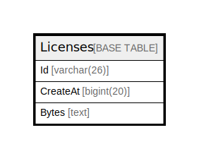

# Licenses

## 概要

<details>
<summary><strong>テーブル定義</strong></summary>

```sql
CREATE TABLE `Licenses` (
  `Id` varchar(26) NOT NULL,
  `CreateAt` bigint(20) DEFAULT NULL,
  `Bytes` text DEFAULT NULL,
  PRIMARY KEY (`Id`)
) ENGINE=InnoDB DEFAULT CHARSET=utf8mb4
```

</details>

## カラム一覧

| 名前       | タイプ         | デフォルト値       | NULL許可   | 子テーブル      | 親テーブル      | コメント     |
| -------- | ----------- | ------------ | -------- | ---------- | ---------- | -------- |
| Id       | varchar(26) |              | false    |            |            |          |
| CreateAt | bigint(20)  | NULL         | true     |            |            |          |
| Bytes    | text        | NULL         | true     |            |            |          |

## 制約一覧

| 名前      | タイプ         | 定義               |
| ------- | ----------- | ---------------- |
| PRIMARY | PRIMARY KEY | PRIMARY KEY (Id) |

## INDEX一覧

| 名前      | 定義                           |
| ------- | ---------------------------- |
| PRIMARY | PRIMARY KEY (Id) USING BTREE |

## ER図



---

> Generated by [tbls](https://github.com/k1LoW/tbls)
