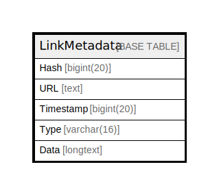

# LinkMetadata

## 概要

<details>
<summary><strong>テーブル定義</strong></summary>

```sql
CREATE TABLE `LinkMetadata` (
  `Hash` bigint(20) NOT NULL,
  `URL` text DEFAULT NULL,
  `Timestamp` bigint(20) DEFAULT NULL,
  `Type` varchar(16) DEFAULT NULL,
  `Data` longtext CHARACTER SET utf8mb4 COLLATE utf8mb4_bin DEFAULT NULL CHECK (json_valid(`Data`)),
  PRIMARY KEY (`Hash`),
  KEY `idx_link_metadata_url_timestamp` (`URL`(512),`Timestamp`)
) ENGINE=InnoDB DEFAULT CHARSET=utf8mb4
```

</details>

## カラム一覧

| 名前        | タイプ         | デフォルト値       | NULL許可   | 子テーブル      | 親テーブル      | コメント     |
| --------- | ----------- | ------------ | -------- | ---------- | ---------- | -------- |
| Hash      | bigint(20)  |              | false    |            |            |          |
| URL       | text        | NULL         | true     |            |            |          |
| Timestamp | bigint(20)  | NULL         | true     |            |            |          |
| Type      | varchar(16) | NULL         | true     |            |            |          |
| Data      | longtext    | NULL         | true     |            |            |          |

## 制約一覧

| 名前      | タイプ         | 定義                 |
| ------- | ----------- | ------------------ |
| PRIMARY | PRIMARY KEY | PRIMARY KEY (Hash) |

## INDEX一覧

| 名前                              | 定義                                                               |
| ------------------------------- | ---------------------------------------------------------------- |
| idx_link_metadata_url_timestamp | KEY idx_link_metadata_url_timestamp (URL, Timestamp) USING BTREE |
| PRIMARY                         | PRIMARY KEY (Hash) USING BTREE                                   |

## ER図



---

> Generated by [tbls](https://github.com/k1LoW/tbls)
