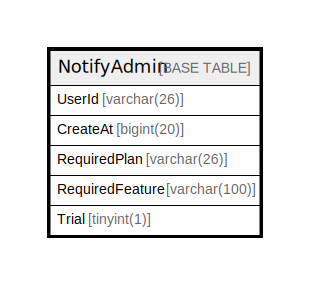

# NotifyAdmin

## 概要

<details>
<summary><strong>テーブル定義</strong></summary>

```sql
CREATE TABLE `NotifyAdmin` (
  `UserId` varchar(26) NOT NULL,
  `CreateAt` bigint(20) DEFAULT NULL,
  `RequiredPlan` varchar(26) NOT NULL,
  `RequiredFeature` varchar(100) NOT NULL,
  `Trial` tinyint(1) NOT NULL,
  PRIMARY KEY (`UserId`,`RequiredFeature`,`RequiredPlan`)
) ENGINE=InnoDB DEFAULT CHARSET=utf8mb4
```

</details>

## カラム一覧

| 名前              | タイプ          | デフォルト値       | NULL許可   | 子テーブル      | 親テーブル      | コメント     |
| --------------- | ------------ | ------------ | -------- | ---------- | ---------- | -------- |
| UserId          | varchar(26)  |              | false    |            |            |          |
| CreateAt        | bigint(20)   | NULL         | true     |            |            |          |
| RequiredPlan    | varchar(26)  |              | false    |            |            |          |
| RequiredFeature | varchar(100) |              | false    |            |            |          |
| Trial           | tinyint(1)   |              | false    |            |            |          |

## 制約一覧

| 名前      | タイプ         | 定義                                                  |
| ------- | ----------- | --------------------------------------------------- |
| PRIMARY | PRIMARY KEY | PRIMARY KEY (UserId, RequiredFeature, RequiredPlan) |

## INDEX一覧

| 名前      | 定義                                                              |
| ------- | --------------------------------------------------------------- |
| PRIMARY | PRIMARY KEY (UserId, RequiredFeature, RequiredPlan) USING BTREE |

## ER図



---

> Generated by [tbls](https://github.com/k1LoW/tbls)
