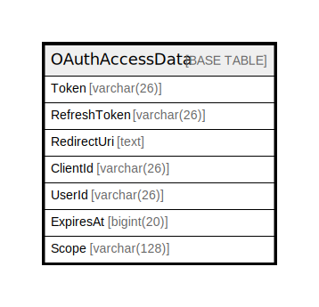

# OAuthAccessData

## 概要

<details>
<summary><strong>テーブル定義</strong></summary>

```sql
CREATE TABLE `OAuthAccessData` (
  `Token` varchar(26) NOT NULL,
  `RefreshToken` varchar(26) DEFAULT NULL,
  `RedirectUri` text DEFAULT NULL,
  `ClientId` varchar(26) DEFAULT NULL,
  `UserId` varchar(26) DEFAULT NULL,
  `ExpiresAt` bigint(20) DEFAULT NULL,
  `Scope` varchar(128) DEFAULT NULL,
  PRIMARY KEY (`Token`),
  UNIQUE KEY `ClientId` (`ClientId`,`UserId`),
  KEY `idx_oauthaccessdata_user_id` (`UserId`),
  KEY `idx_oauthaccessdata_refresh_token` (`RefreshToken`)
) ENGINE=InnoDB DEFAULT CHARSET=utf8mb4
```

</details>

## カラム一覧

| 名前           | タイプ          | デフォルト値       | NULL許可   | 子テーブル      | 親テーブル      | コメント     |
| ------------ | ------------ | ------------ | -------- | ---------- | ---------- | -------- |
| Token        | varchar(26)  |              | false    |            |            |          |
| RefreshToken | varchar(26)  | NULL         | true     |            |            |          |
| RedirectUri  | text         | NULL         | true     |            |            |          |
| ClientId     | varchar(26)  | NULL         | true     |            |            |          |
| UserId       | varchar(26)  | NULL         | true     |            |            |          |
| ExpiresAt    | bigint(20)   | NULL         | true     |            |            |          |
| Scope        | varchar(128) | NULL         | true     |            |            |          |

## 制約一覧

| 名前       | タイプ         | 定義                                     |
| -------- | ----------- | -------------------------------------- |
| ClientId | UNIQUE      | UNIQUE KEY ClientId (ClientId, UserId) |
| PRIMARY  | PRIMARY KEY | PRIMARY KEY (Token)                    |

## INDEX一覧

| 名前                                | 定義                                                               |
| --------------------------------- | ---------------------------------------------------------------- |
| idx_oauthaccessdata_refresh_token | KEY idx_oauthaccessdata_refresh_token (RefreshToken) USING BTREE |
| idx_oauthaccessdata_user_id       | KEY idx_oauthaccessdata_user_id (UserId) USING BTREE             |
| PRIMARY                           | PRIMARY KEY (Token) USING BTREE                                  |
| ClientId                          | UNIQUE KEY ClientId (ClientId, UserId) USING BTREE               |

## ER図



---

> Generated by [tbls](https://github.com/k1LoW/tbls)
