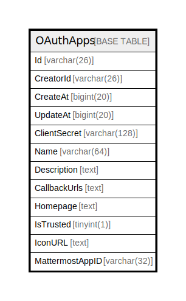

# OAuthApps

## 概要

<details>
<summary><strong>テーブル定義</strong></summary>

```sql
CREATE TABLE `OAuthApps` (
  `Id` varchar(26) NOT NULL,
  `CreatorId` varchar(26) DEFAULT NULL,
  `CreateAt` bigint(20) DEFAULT NULL,
  `UpdateAt` bigint(20) DEFAULT NULL,
  `ClientSecret` varchar(128) DEFAULT NULL,
  `Name` varchar(64) DEFAULT NULL,
  `Description` text DEFAULT NULL,
  `CallbackUrls` text DEFAULT NULL,
  `Homepage` text DEFAULT NULL,
  `IsTrusted` tinyint(1) DEFAULT NULL,
  `IconURL` text DEFAULT NULL,
  `MattermostAppID` varchar(32) NOT NULL DEFAULT '',
  PRIMARY KEY (`Id`),
  KEY `idx_oauthapps_creator_id` (`CreatorId`)
) ENGINE=InnoDB DEFAULT CHARSET=utf8mb4
```

</details>

## カラム一覧

| 名前              | タイプ          | デフォルト値       | NULL許可   | 子テーブル      | 親テーブル      | コメント     |
| --------------- | ------------ | ------------ | -------- | ---------- | ---------- | -------- |
| Id              | varchar(26)  |              | false    |            |            |          |
| CreatorId       | varchar(26)  | NULL         | true     |            |            |          |
| CreateAt        | bigint(20)   | NULL         | true     |            |            |          |
| UpdateAt        | bigint(20)   | NULL         | true     |            |            |          |
| ClientSecret    | varchar(128) | NULL         | true     |            |            |          |
| Name            | varchar(64)  | NULL         | true     |            |            |          |
| Description     | text         | NULL         | true     |            |            |          |
| CallbackUrls    | text         | NULL         | true     |            |            |          |
| Homepage        | text         | NULL         | true     |            |            |          |
| IsTrusted       | tinyint(1)   | NULL         | true     |            |            |          |
| IconURL         | text         | NULL         | true     |            |            |          |
| MattermostAppID | varchar(32)  | ''           | false    |            |            |          |

## 制約一覧

| 名前      | タイプ         | 定義               |
| ------- | ----------- | ---------------- |
| PRIMARY | PRIMARY KEY | PRIMARY KEY (Id) |

## INDEX一覧

| 名前                       | 定義                                                   |
| ------------------------ | ---------------------------------------------------- |
| idx_oauthapps_creator_id | KEY idx_oauthapps_creator_id (CreatorId) USING BTREE |
| PRIMARY                  | PRIMARY KEY (Id) USING BTREE                         |

## ER図



---

> Generated by [tbls](https://github.com/k1LoW/tbls)
