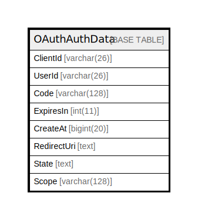

# OAuthAuthData

## 概要

<details>
<summary><strong>テーブル定義</strong></summary>

```sql
CREATE TABLE `OAuthAuthData` (
  `ClientId` varchar(26) DEFAULT NULL,
  `UserId` varchar(26) DEFAULT NULL,
  `Code` varchar(128) NOT NULL,
  `ExpiresIn` int(11) DEFAULT NULL,
  `CreateAt` bigint(20) DEFAULT NULL,
  `RedirectUri` text DEFAULT NULL,
  `State` text DEFAULT NULL,
  `Scope` varchar(128) DEFAULT NULL,
  PRIMARY KEY (`Code`)
) ENGINE=InnoDB DEFAULT CHARSET=utf8mb4
```

</details>

## カラム一覧

| 名前          | タイプ          | デフォルト値       | NULL許可   | 子テーブル      | 親テーブル      | コメント     |
| ----------- | ------------ | ------------ | -------- | ---------- | ---------- | -------- |
| ClientId    | varchar(26)  | NULL         | true     |            |            |          |
| UserId      | varchar(26)  | NULL         | true     |            |            |          |
| Code        | varchar(128) |              | false    |            |            |          |
| ExpiresIn   | int(11)      | NULL         | true     |            |            |          |
| CreateAt    | bigint(20)   | NULL         | true     |            |            |          |
| RedirectUri | text         | NULL         | true     |            |            |          |
| State       | text         | NULL         | true     |            |            |          |
| Scope       | varchar(128) | NULL         | true     |            |            |          |

## 制約一覧

| 名前      | タイプ         | 定義                 |
| ------- | ----------- | ------------------ |
| PRIMARY | PRIMARY KEY | PRIMARY KEY (Code) |

## INDEX一覧

| 名前      | 定義                             |
| ------- | ------------------------------ |
| PRIMARY | PRIMARY KEY (Code) USING BTREE |

## ER図



---

> Generated by [tbls](https://github.com/k1LoW/tbls)
