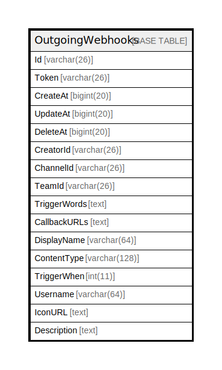

# OutgoingWebhooks

## 概要

<details>
<summary><strong>テーブル定義</strong></summary>

```sql
CREATE TABLE `OutgoingWebhooks` (
  `Id` varchar(26) NOT NULL,
  `Token` varchar(26) DEFAULT NULL,
  `CreateAt` bigint(20) DEFAULT NULL,
  `UpdateAt` bigint(20) DEFAULT NULL,
  `DeleteAt` bigint(20) DEFAULT NULL,
  `CreatorId` varchar(26) DEFAULT NULL,
  `ChannelId` varchar(26) DEFAULT NULL,
  `TeamId` varchar(26) DEFAULT NULL,
  `TriggerWords` text DEFAULT NULL,
  `CallbackURLs` text DEFAULT NULL,
  `DisplayName` varchar(64) DEFAULT NULL,
  `ContentType` varchar(128) DEFAULT NULL,
  `TriggerWhen` int(11) DEFAULT NULL,
  `Username` varchar(64) DEFAULT NULL,
  `IconURL` text DEFAULT NULL,
  `Description` text DEFAULT NULL,
  PRIMARY KEY (`Id`),
  KEY `idx_outgoing_webhook_team_id` (`TeamId`),
  KEY `idx_outgoing_webhook_update_at` (`UpdateAt`),
  KEY `idx_outgoing_webhook_create_at` (`CreateAt`),
  KEY `idx_outgoing_webhook_delete_at` (`DeleteAt`)
) ENGINE=InnoDB DEFAULT CHARSET=utf8mb4
```

</details>

## カラム一覧

| 名前           | タイプ          | デフォルト値       | NULL許可   | 子テーブル      | 親テーブル      | コメント     |
| ------------ | ------------ | ------------ | -------- | ---------- | ---------- | -------- |
| Id           | varchar(26)  |              | false    |            |            |          |
| Token        | varchar(26)  | NULL         | true     |            |            |          |
| CreateAt     | bigint(20)   | NULL         | true     |            |            |          |
| UpdateAt     | bigint(20)   | NULL         | true     |            |            |          |
| DeleteAt     | bigint(20)   | NULL         | true     |            |            |          |
| CreatorId    | varchar(26)  | NULL         | true     |            |            |          |
| ChannelId    | varchar(26)  | NULL         | true     |            |            |          |
| TeamId       | varchar(26)  | NULL         | true     |            |            |          |
| TriggerWords | text         | NULL         | true     |            |            |          |
| CallbackURLs | text         | NULL         | true     |            |            |          |
| DisplayName  | varchar(64)  | NULL         | true     |            |            |          |
| ContentType  | varchar(128) | NULL         | true     |            |            |          |
| TriggerWhen  | int(11)      | NULL         | true     |            |            |          |
| Username     | varchar(64)  | NULL         | true     |            |            |          |
| IconURL      | text         | NULL         | true     |            |            |          |
| Description  | text         | NULL         | true     |            |            |          |

## 制約一覧

| 名前      | タイプ         | 定義               |
| ------- | ----------- | ---------------- |
| PRIMARY | PRIMARY KEY | PRIMARY KEY (Id) |

## INDEX一覧

| 名前                             | 定義                                                        |
| ------------------------------ | --------------------------------------------------------- |
| idx_outgoing_webhook_create_at | KEY idx_outgoing_webhook_create_at (CreateAt) USING BTREE |
| idx_outgoing_webhook_delete_at | KEY idx_outgoing_webhook_delete_at (DeleteAt) USING BTREE |
| idx_outgoing_webhook_team_id   | KEY idx_outgoing_webhook_team_id (TeamId) USING BTREE     |
| idx_outgoing_webhook_update_at | KEY idx_outgoing_webhook_update_at (UpdateAt) USING BTREE |
| PRIMARY                        | PRIMARY KEY (Id) USING BTREE                              |

## ER図



---

> Generated by [tbls](https://github.com/k1LoW/tbls)
