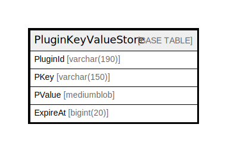

# PluginKeyValueStore

## 概要

<details>
<summary><strong>テーブル定義</strong></summary>

```sql
CREATE TABLE `PluginKeyValueStore` (
  `PluginId` varchar(190) NOT NULL,
  `PKey` varchar(150) NOT NULL,
  `PValue` mediumblob DEFAULT NULL,
  `ExpireAt` bigint(20) DEFAULT NULL,
  PRIMARY KEY (`PluginId`,`PKey`)
) ENGINE=InnoDB DEFAULT CHARSET=utf8mb4
```

</details>

## カラム一覧

| 名前       | タイプ          | デフォルト値       | NULL許可   | 子テーブル      | 親テーブル      | コメント     |
| -------- | ------------ | ------------ | -------- | ---------- | ---------- | -------- |
| PluginId | varchar(190) |              | false    |            |            |          |
| PKey     | varchar(150) |              | false    |            |            |          |
| PValue   | mediumblob   | NULL         | true     |            |            |          |
| ExpireAt | bigint(20)   | NULL         | true     |            |            |          |

## 制約一覧

| 名前      | タイプ         | 定義                           |
| ------- | ----------- | ---------------------------- |
| PRIMARY | PRIMARY KEY | PRIMARY KEY (PluginId, PKey) |

## INDEX一覧

| 名前      | 定義                                       |
| ------- | ---------------------------------------- |
| PRIMARY | PRIMARY KEY (PluginId, PKey) USING BTREE |

## ER図



---

> Generated by [tbls](https://github.com/k1LoW/tbls)
