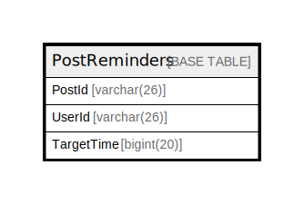

# PostReminders

## 概要

<details>
<summary><strong>テーブル定義</strong></summary>

```sql
CREATE TABLE `PostReminders` (
  `PostId` varchar(26) NOT NULL,
  `UserId` varchar(26) NOT NULL,
  `TargetTime` bigint(20) DEFAULT NULL,
  PRIMARY KEY (`PostId`,`UserId`),
  KEY `idx_postreminders_targettime` (`TargetTime`)
) ENGINE=InnoDB DEFAULT CHARSET=utf8mb4
```

</details>

## カラム一覧

| 名前         | タイプ         | デフォルト値       | NULL許可   | 子テーブル      | 親テーブル      | コメント     |
| ---------- | ----------- | ------------ | -------- | ---------- | ---------- | -------- |
| PostId     | varchar(26) |              | false    |            |            |          |
| UserId     | varchar(26) |              | false    |            |            |          |
| TargetTime | bigint(20)  | NULL         | true     |            |            |          |

## 制約一覧

| 名前      | タイプ         | 定義                           |
| ------- | ----------- | ---------------------------- |
| PRIMARY | PRIMARY KEY | PRIMARY KEY (PostId, UserId) |

## INDEX一覧

| 名前                           | 定義                                                        |
| ---------------------------- | --------------------------------------------------------- |
| idx_postreminders_targettime | KEY idx_postreminders_targettime (TargetTime) USING BTREE |
| PRIMARY                      | PRIMARY KEY (PostId, UserId) USING BTREE                  |

## ER図



---

> Generated by [tbls](https://github.com/k1LoW/tbls)
