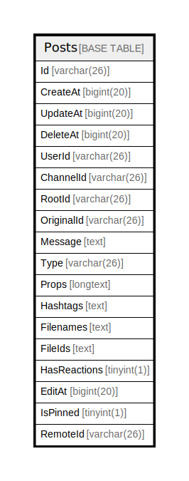

# Posts

## 概要

<details>
<summary><strong>テーブル定義</strong></summary>

```sql
CREATE TABLE `Posts` (
  `Id` varchar(26) NOT NULL,
  `CreateAt` bigint(20) DEFAULT NULL,
  `UpdateAt` bigint(20) DEFAULT NULL,
  `DeleteAt` bigint(20) DEFAULT NULL,
  `UserId` varchar(26) DEFAULT NULL,
  `ChannelId` varchar(26) DEFAULT NULL,
  `RootId` varchar(26) DEFAULT NULL,
  `OriginalId` varchar(26) DEFAULT NULL,
  `Message` text DEFAULT NULL,
  `Type` varchar(26) DEFAULT NULL,
  `Props` longtext CHARACTER SET utf8mb4 COLLATE utf8mb4_bin DEFAULT NULL CHECK (json_valid(`Props`)),
  `Hashtags` text DEFAULT NULL,
  `Filenames` text DEFAULT NULL,
  `FileIds` text DEFAULT NULL,
  `HasReactions` tinyint(1) DEFAULT NULL,
  `EditAt` bigint(20) DEFAULT NULL,
  `IsPinned` tinyint(1) DEFAULT NULL,
  `RemoteId` varchar(26) DEFAULT NULL,
  PRIMARY KEY (`Id`),
  KEY `idx_posts_update_at` (`UpdateAt`),
  KEY `idx_posts_create_at` (`CreateAt`),
  KEY `idx_posts_delete_at` (`DeleteAt`),
  KEY `idx_posts_user_id` (`UserId`),
  KEY `idx_posts_is_pinned` (`IsPinned`),
  KEY `idx_posts_channel_id_update_at` (`ChannelId`,`UpdateAt`),
  KEY `idx_posts_channel_id_delete_at_create_at` (`ChannelId`,`DeleteAt`,`CreateAt`),
  KEY `idx_posts_root_id_delete_at` (`RootId`,`DeleteAt`),
  KEY `idx_posts_create_at_id` (`CreateAt`,`Id`),
  FULLTEXT KEY `idx_posts_message_txt` (`Message`),
  FULLTEXT KEY `idx_posts_hashtags_txt` (`Hashtags`)
) ENGINE=InnoDB DEFAULT CHARSET=utf8mb4
```

</details>

## カラム一覧

| 名前           | タイプ         | デフォルト値       | NULL許可   | 子テーブル      | 親テーブル      | コメント     |
| ------------ | ----------- | ------------ | -------- | ---------- | ---------- | -------- |
| Id           | varchar(26) |              | false    |            |            |          |
| CreateAt     | bigint(20)  | NULL         | true     |            |            |          |
| UpdateAt     | bigint(20)  | NULL         | true     |            |            |          |
| DeleteAt     | bigint(20)  | NULL         | true     |            |            |          |
| UserId       | varchar(26) | NULL         | true     |            |            |          |
| ChannelId    | varchar(26) | NULL         | true     |            |            |          |
| RootId       | varchar(26) | NULL         | true     |            |            |          |
| OriginalId   | varchar(26) | NULL         | true     |            |            |          |
| Message      | text        | NULL         | true     |            |            |          |
| Type         | varchar(26) | NULL         | true     |            |            |          |
| Props        | longtext    | NULL         | true     |            |            |          |
| Hashtags     | text        | NULL         | true     |            |            |          |
| Filenames    | text        | NULL         | true     |            |            |          |
| FileIds      | text        | NULL         | true     |            |            |          |
| HasReactions | tinyint(1)  | NULL         | true     |            |            |          |
| EditAt       | bigint(20)  | NULL         | true     |            |            |          |
| IsPinned     | tinyint(1)  | NULL         | true     |            |            |          |
| RemoteId     | varchar(26) | NULL         | true     |            |            |          |

## 制約一覧

| 名前      | タイプ         | 定義               |
| ------- | ----------- | ---------------- |
| PRIMARY | PRIMARY KEY | PRIMARY KEY (Id) |

## INDEX一覧

| 名前                                       | 定義                                                                                       |
| ---------------------------------------- | ---------------------------------------------------------------------------------------- |
| idx_posts_channel_id_delete_at_create_at | KEY idx_posts_channel_id_delete_at_create_at (ChannelId, DeleteAt, CreateAt) USING BTREE |
| idx_posts_channel_id_update_at           | KEY idx_posts_channel_id_update_at (ChannelId, UpdateAt) USING BTREE                     |
| idx_posts_create_at                      | KEY idx_posts_create_at (CreateAt) USING BTREE                                           |
| idx_posts_create_at_id                   | KEY idx_posts_create_at_id (CreateAt, Id) USING BTREE                                    |
| idx_posts_delete_at                      | KEY idx_posts_delete_at (DeleteAt) USING BTREE                                           |
| idx_posts_hashtags_txt                   | KEY idx_posts_hashtags_txt (Hashtags) USING FULLTEXT                                     |
| idx_posts_is_pinned                      | KEY idx_posts_is_pinned (IsPinned) USING BTREE                                           |
| idx_posts_message_txt                    | KEY idx_posts_message_txt (Message) USING FULLTEXT                                       |
| idx_posts_root_id_delete_at              | KEY idx_posts_root_id_delete_at (RootId, DeleteAt) USING BTREE                           |
| idx_posts_update_at                      | KEY idx_posts_update_at (UpdateAt) USING BTREE                                           |
| idx_posts_user_id                        | KEY idx_posts_user_id (UserId) USING BTREE                                               |
| PRIMARY                                  | PRIMARY KEY (Id) USING BTREE                                                             |

## ER図



---

> Generated by [tbls](https://github.com/k1LoW/tbls)
