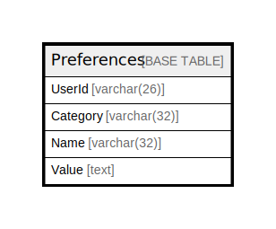

# Preferences

## 概要

<details>
<summary><strong>テーブル定義</strong></summary>

```sql
CREATE TABLE `Preferences` (
  `UserId` varchar(26) NOT NULL,
  `Category` varchar(32) NOT NULL,
  `Name` varchar(32) NOT NULL,
  `Value` text DEFAULT NULL,
  PRIMARY KEY (`UserId`,`Category`,`Name`),
  KEY `idx_preferences_category` (`Category`),
  KEY `idx_preferences_name` (`Name`)
) ENGINE=InnoDB DEFAULT CHARSET=utf8mb4
```

</details>

## カラム一覧

| 名前       | タイプ         | デフォルト値       | NULL許可   | 子テーブル      | 親テーブル      | コメント     |
| -------- | ----------- | ------------ | -------- | ---------- | ---------- | -------- |
| UserId   | varchar(26) |              | false    |            |            |          |
| Category | varchar(32) |              | false    |            |            |          |
| Name     | varchar(32) |              | false    |            |            |          |
| Value    | text        | NULL         | true     |            |            |          |

## 制約一覧

| 名前      | タイプ         | 定義                                   |
| ------- | ----------- | ------------------------------------ |
| PRIMARY | PRIMARY KEY | PRIMARY KEY (UserId, Category, Name) |

## INDEX一覧

| 名前                       | 定義                                                  |
| ------------------------ | --------------------------------------------------- |
| idx_preferences_category | KEY idx_preferences_category (Category) USING BTREE |
| idx_preferences_name     | KEY idx_preferences_name (Name) USING BTREE         |
| PRIMARY                  | PRIMARY KEY (UserId, Category, Name) USING BTREE    |

## ER図



---

> Generated by [tbls](https://github.com/k1LoW/tbls)
