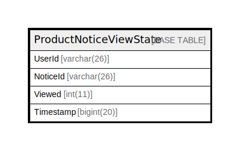

# ProductNoticeViewState

## 概要

<details>
<summary><strong>テーブル定義</strong></summary>

```sql
CREATE TABLE `ProductNoticeViewState` (
  `UserId` varchar(26) NOT NULL,
  `NoticeId` varchar(26) NOT NULL,
  `Viewed` int(11) DEFAULT NULL,
  `Timestamp` bigint(20) DEFAULT NULL,
  PRIMARY KEY (`UserId`,`NoticeId`),
  KEY `idx_notice_views_timestamp` (`Timestamp`),
  KEY `idx_notice_views_notice_id` (`NoticeId`)
) ENGINE=InnoDB DEFAULT CHARSET=utf8mb4
```

</details>

## カラム一覧

| 名前        | タイプ         | デフォルト値       | NULL許可   | 子テーブル      | 親テーブル      | コメント     |
| --------- | ----------- | ------------ | -------- | ---------- | ---------- | -------- |
| UserId    | varchar(26) |              | false    |            |            |          |
| NoticeId  | varchar(26) |              | false    |            |            |          |
| Viewed    | int(11)     | NULL         | true     |            |            |          |
| Timestamp | bigint(20)  | NULL         | true     |            |            |          |

## 制約一覧

| 名前      | タイプ         | 定義                             |
| ------- | ----------- | ------------------------------ |
| PRIMARY | PRIMARY KEY | PRIMARY KEY (UserId, NoticeId) |

## INDEX一覧

| 名前                         | 定義                                                     |
| -------------------------- | ------------------------------------------------------ |
| idx_notice_views_notice_id | KEY idx_notice_views_notice_id (NoticeId) USING BTREE  |
| idx_notice_views_timestamp | KEY idx_notice_views_timestamp (Timestamp) USING BTREE |
| PRIMARY                    | PRIMARY KEY (UserId, NoticeId) USING BTREE             |

## ER図



---

> Generated by [tbls](https://github.com/k1LoW/tbls)
