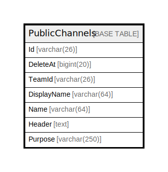

# PublicChannels

## 概要

<details>
<summary><strong>テーブル定義</strong></summary>

```sql
CREATE TABLE `PublicChannels` (
  `Id` varchar(26) NOT NULL,
  `DeleteAt` bigint(20) DEFAULT NULL,
  `TeamId` varchar(26) DEFAULT NULL,
  `DisplayName` varchar(64) DEFAULT NULL,
  `Name` varchar(64) DEFAULT NULL,
  `Header` text DEFAULT NULL,
  `Purpose` varchar(250) DEFAULT NULL,
  PRIMARY KEY (`Id`),
  UNIQUE KEY `Name` (`Name`,`TeamId`),
  KEY `idx_publicchannels_team_id` (`TeamId`),
  KEY `idx_publicchannels_delete_at` (`DeleteAt`),
  FULLTEXT KEY `idx_publicchannels_search_txt` (`Name`,`DisplayName`,`Purpose`)
) ENGINE=InnoDB DEFAULT CHARSET=utf8mb4
```

</details>

## カラム一覧

| 名前          | タイプ          | デフォルト値       | NULL許可   | 子テーブル      | 親テーブル      | コメント     |
| ----------- | ------------ | ------------ | -------- | ---------- | ---------- | -------- |
| Id          | varchar(26)  |              | false    |            |            |          |
| DeleteAt    | bigint(20)   | NULL         | true     |            |            |          |
| TeamId      | varchar(26)  | NULL         | true     |            |            |          |
| DisplayName | varchar(64)  | NULL         | true     |            |            |          |
| Name        | varchar(64)  | NULL         | true     |            |            |          |
| Header      | text         | NULL         | true     |            |            |          |
| Purpose     | varchar(250) | NULL         | true     |            |            |          |

## 制約一覧

| 名前      | タイプ         | 定義                             |
| ------- | ----------- | ------------------------------ |
| Name    | UNIQUE      | UNIQUE KEY Name (Name, TeamId) |
| PRIMARY | PRIMARY KEY | PRIMARY KEY (Id)               |

## INDEX一覧

| 名前                            | 定義                                                                            |
| ----------------------------- | ----------------------------------------------------------------------------- |
| idx_publicchannels_delete_at  | KEY idx_publicchannels_delete_at (DeleteAt) USING BTREE                       |
| idx_publicchannels_search_txt | KEY idx_publicchannels_search_txt (Name, DisplayName, Purpose) USING FULLTEXT |
| idx_publicchannels_team_id    | KEY idx_publicchannels_team_id (TeamId) USING BTREE                           |
| PRIMARY                       | PRIMARY KEY (Id) USING BTREE                                                  |
| Name                          | UNIQUE KEY Name (Name, TeamId) USING BTREE                                    |

## ER図



---

> Generated by [tbls](https://github.com/k1LoW/tbls)
