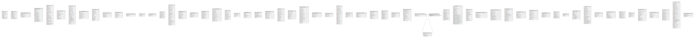

# Database Schema

## テーブル一覧

| 名前                                                                                    | カラム一覧      | コメント     | タイプ        |
| ------------------------------------------------------------------------------------- | ---------- | -------- | ---------- |
| [public.db_lock](public.db_lock.md)                                                   | 2          |          | BASE TABLE |
| [public.db_config_migrations](public.db_config_migrations.md)                         | 2          |          | BASE TABLE |
| [public.configurations](public.configurations.md)                                     | 5          |          | BASE TABLE |
| [public.configurationfiles](public.configurationfiles.md)                             | 4          |          | BASE TABLE |
| [public.db_migrations](public.db_migrations.md)                                       | 2          |          | BASE TABLE |
| [public.teams](public.teams.md)                                                       | 17         |          | BASE TABLE |
| [public.teammembers](public.teammembers.md)                                           | 8          |          | BASE TABLE |
| [public.clusterdiscovery](public.clusterdiscovery.md)                                 | 8          |          | BASE TABLE |
| [public.commandwebhooks](public.commandwebhooks.md)                                   | 7          |          | BASE TABLE |
| [public.compliances](public.compliances.md)                                           | 11         |          | BASE TABLE |
| [public.emoji](public.emoji.md)                                                       | 6          |          | BASE TABLE |
| [public.usergroups](public.usergroups.md)                                             | 10         |          | BASE TABLE |
| [public.groupmembers](public.groupmembers.md)                                         | 4          |          | BASE TABLE |
| [public.groupteams](public.groupteams.md)                                             | 7          |          | BASE TABLE |
| [public.groupchannels](public.groupchannels.md)                                       | 7          |          | BASE TABLE |
| [public.linkmetadata](public.linkmetadata.md)                                         | 5          |          | BASE TABLE |
| [public.commands](public.commands.md)                                                 | 18         |          | BASE TABLE |
| [public.incomingwebhooks](public.incomingwebhooks.md)                                 | 12         |          | BASE TABLE |
| [public.outgoingwebhooks](public.outgoingwebhooks.md)                                 | 16         |          | BASE TABLE |
| [public.systems](public.systems.md)                                                   | 2          |          | BASE TABLE |
| [public.reactions](public.reactions.md)                                               | 8          |          | BASE TABLE |
| [public.roles](public.roles.md)                                                       | 10         |          | BASE TABLE |
| [public.schemes](public.schemes.md)                                                   | 18         |          | BASE TABLE |
| [public.licenses](public.licenses.md)                                                 | 3          |          | BASE TABLE |
| [public.posts](public.posts.md)                                                       | 18         |          | BASE TABLE |
| [public.productnoticeviewstate](public.productnoticeviewstate.md)                     | 4          |          | BASE TABLE |
| [public.sessions](public.sessions.md)                                                 | 11         |          | BASE TABLE |
| [public.termsofservice](public.termsofservice.md)                                     | 4          |          | BASE TABLE |
| [public.audits](public.audits.md)                                                     | 7          |          | BASE TABLE |
| [public.oauthaccessdata](public.oauthaccessdata.md)                                   | 7          |          | BASE TABLE |
| [public.preferences](public.preferences.md)                                           | 4          |          | BASE TABLE |
| [public.status](public.status.md)                                                     | 6          |          | BASE TABLE |
| [public.tokens](public.tokens.md)                                                     | 4          |          | BASE TABLE |
| [public.bots](public.bots.md)                                                         | 7          |          | BASE TABLE |
| [public.useraccesstokens](public.useraccesstokens.md)                                 | 5          |          | BASE TABLE |
| [public.remoteclusters](public.remoteclusters.md)                                     | 11         |          | BASE TABLE |
| [public.sharedchannels](public.sharedchannels.md)                                     | 12         |          | BASE TABLE |
| [public.sidebarchannels](public.sidebarchannels.md)                                   | 4          |          | BASE TABLE |
| [public.oauthauthdata](public.oauthauthdata.md)                                       | 8          |          | BASE TABLE |
| [public.sharedchannelattachments](public.sharedchannelattachments.md)                 | 5          |          | BASE TABLE |
| [public.sharedchannelusers](public.sharedchannelusers.md)                             | 6          |          | BASE TABLE |
| [public.sharedchannelremotes](public.sharedchannelremotes.md)                         | 10         |          | BASE TABLE |
| [public.jobs](public.jobs.md)                                                         | 9          |          | BASE TABLE |
| [public.channelmemberhistory](public.channelmemberhistory.md)                         | 4          |          | BASE TABLE |
| [public.sidebarcategories](public.sidebarcategories.md)                               | 9          |          | BASE TABLE |
| [public.uploadsessions](public.uploadsessions.md)                                     | 11         |          | BASE TABLE |
| [public.threads](public.threads.md)                                                   | 6          |          | BASE TABLE |
| [public.threadmemberships](public.threadmemberships.md)                               | 6          |          | BASE TABLE |
| [public.usertermsofservice](public.usertermsofservice.md)                             | 3          |          | BASE TABLE |
| [public.pluginkeyvaluestore](public.pluginkeyvaluestore.md)                           | 4          |          | BASE TABLE |
| [public.users](public.users.md)                                                       | 26         |          | BASE TABLE |
| [public.fileinfo](public.fileinfo.md)                                                 | 20         |          | BASE TABLE |
| [public.oauthapps](public.oauthapps.md)                                               | 12         |          | BASE TABLE |
| [public.channels](public.channels.md)                                                 | 19         |          | BASE TABLE |
| [public.channelmembers](public.channelmembers.md)                                     | 13         |          | BASE TABLE |
| [public.publicchannels](public.publicchannels.md)                                     | 7          |          | BASE TABLE |
| [public.retentionpolicies](public.retentionpolicies.md)                               | 3          |          | BASE TABLE |
| [public.retentionpoliciesteams](public.retentionpoliciesteams.md)                     | 2          |          | BASE TABLE |
| [public.retentionpolicieschannels](public.retentionpolicieschannels.md)               | 2          |          | BASE TABLE |
| [public.recentsearches](public.recentsearches.md)                                     | 4          |          | BASE TABLE |
| [public.postreminders](public.postreminders.md)                                       | 3          |          | BASE TABLE |
| [public.notifyadmin](public.notifyadmin.md)                                           | 5          |          | BASE TABLE |
| [public.ir_system](public.ir_system.md)                                               | 2          |          | BASE TABLE |
| [public.ir_incident](public.ir_incident.md)                                           | 44         |          | BASE TABLE |
| [public.ir_playbook](public.ir_playbook.md)                                           | 42         |          | BASE TABLE |
| [public.ir_playbookmember](public.ir_playbookmember.md)                               | 3          |          | BASE TABLE |
| [public.ir_statusposts](public.ir_statusposts.md)                                     | 2          |          | BASE TABLE |
| [public.ir_timelineevent](public.ir_timelineevent.md)                                 | 11         |          | BASE TABLE |
| [public.ir_viewedchannel](public.ir_viewedchannel.md)                                 | 2          |          | BASE TABLE |
| [public.focalboard_schema_migrations](public.focalboard_schema_migrations.md)         | 2          |          | BASE TABLE |
| [public.focalboard_blocks_history](public.focalboard_blocks_history.md)               | 15         |          | BASE TABLE |
| [public.focalboard_system_settings](public.focalboard_system_settings.md)             | 2          |          | BASE TABLE |
| [public.focalboard_users](public.focalboard_users.md)                                 | 11         |          | BASE TABLE |
| [public.focalboard_sessions](public.focalboard_sessions.md)                           | 7          |          | BASE TABLE |
| [public.focalboard_sharing](public.focalboard_sharing.md)                             | 6          |          | BASE TABLE |
| [public.focalboard_teams](public.focalboard_teams.md)                                 | 5          |          | BASE TABLE |
| [public.ir_userinfo](public.ir_userinfo.md)                                           | 3          |          | BASE TABLE |
| [public.focalboard_blocks](public.focalboard_blocks.md)                               | 15         |          | BASE TABLE |
| [public.ir_run_participants](public.ir_run_participants.md)                           | 3          |          | BASE TABLE |
| [public.focalboard_subscriptions](public.focalboard_subscriptions.md)                 | 8          |          | BASE TABLE |
| [public.focalboard_notification_hints](public.focalboard_notification_hints.md)       | 6          |          | BASE TABLE |
| [public.ir_playbookautofollow](public.ir_playbookautofollow.md)                       | 2          |          | BASE TABLE |
| [public.focalboard_file_info](public.focalboard_file_info.md)                         | 7          |          | BASE TABLE |
| [public.focalboard_boards](public.focalboard_boards.md)                               | 19         |          | BASE TABLE |
| [public.focalboard_boards_history](public.focalboard_boards_history.md)               | 19         |          | BASE TABLE |
| [public.focalboard_board_members](public.focalboard_board_members.md)                 | 7          |          | BASE TABLE |
| [public.ir_metricconfig](public.ir_metricconfig.md)                                   | 8          |          | BASE TABLE |
| [public.focalboard_categories](public.focalboard_categories.md)                       | 10         |          | BASE TABLE |
| [public.ir_metric](public.ir_metric.md)                                               | 4          |          | BASE TABLE |
| [public.focalboard_category_boards](public.focalboard_category_boards.md)             | 7          |          | BASE TABLE |
| [public.focalboard_board_members_history](public.focalboard_board_members_history.md) | 4          |          | BASE TABLE |
| [public.ir_channelaction](public.ir_channelaction.md)                                 | 7          |          | BASE TABLE |
| [public.focalboard_preferences](public.focalboard_preferences.md)                     | 4          |          | BASE TABLE |
| [public.ir_category](public.ir_category.md)                                           | 8          |          | BASE TABLE |
| [public.ir_category_item](public.ir_category_item.md)                                 | 3          |          | BASE TABLE |

## ER図

---

> Generated by [tbls](https://github.com/k1LoW/tbls)
