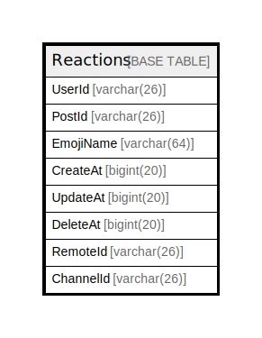

# Reactions

## 概要

<details>
<summary><strong>テーブル定義</strong></summary>

```sql
CREATE TABLE `Reactions` (
  `UserId` varchar(26) NOT NULL,
  `PostId` varchar(26) NOT NULL,
  `EmojiName` varchar(64) NOT NULL,
  `CreateAt` bigint(20) DEFAULT NULL,
  `UpdateAt` bigint(20) DEFAULT NULL,
  `DeleteAt` bigint(20) DEFAULT NULL,
  `RemoteId` varchar(26) DEFAULT NULL,
  `ChannelId` varchar(26) NOT NULL DEFAULT '',
  PRIMARY KEY (`PostId`,`UserId`,`EmojiName`),
  KEY `idx_reactions_channel_id` (`ChannelId`)
) ENGINE=InnoDB DEFAULT CHARSET=utf8mb4
```

</details>

## カラム一覧

| 名前        | タイプ         | デフォルト値       | NULL許可   | 子テーブル      | 親テーブル      | コメント     |
| --------- | ----------- | ------------ | -------- | ---------- | ---------- | -------- |
| UserId    | varchar(26) |              | false    |            |            |          |
| PostId    | varchar(26) |              | false    |            |            |          |
| EmojiName | varchar(64) |              | false    |            |            |          |
| CreateAt  | bigint(20)  | NULL         | true     |            |            |          |
| UpdateAt  | bigint(20)  | NULL         | true     |            |            |          |
| DeleteAt  | bigint(20)  | NULL         | true     |            |            |          |
| RemoteId  | varchar(26) | NULL         | true     |            |            |          |
| ChannelId | varchar(26) | ''           | false    |            |            |          |

## 制約一覧

| 名前      | タイプ         | 定義                                      |
| ------- | ----------- | --------------------------------------- |
| PRIMARY | PRIMARY KEY | PRIMARY KEY (PostId, UserId, EmojiName) |

## INDEX一覧

| 名前                       | 定義                                                   |
| ------------------------ | ---------------------------------------------------- |
| idx_reactions_channel_id | KEY idx_reactions_channel_id (ChannelId) USING BTREE |
| PRIMARY                  | PRIMARY KEY (PostId, UserId, EmojiName) USING BTREE  |

## ER図



---

> Generated by [tbls](https://github.com/k1LoW/tbls)
