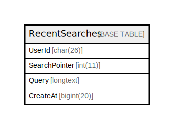

# RecentSearches

## 概要

<details>
<summary><strong>テーブル定義</strong></summary>

```sql
CREATE TABLE `RecentSearches` (
  `UserId` char(26) NOT NULL,
  `SearchPointer` int(11) NOT NULL,
  `Query` longtext CHARACTER SET utf8mb4 COLLATE utf8mb4_bin DEFAULT NULL CHECK (json_valid(`Query`)),
  `CreateAt` bigint(20) NOT NULL,
  PRIMARY KEY (`UserId`,`SearchPointer`)
) ENGINE=InnoDB DEFAULT CHARSET=utf8mb4
```

</details>

## カラム一覧

| 名前            | タイプ        | デフォルト値       | NULL許可   | 子テーブル      | 親テーブル      | コメント     |
| ------------- | ---------- | ------------ | -------- | ---------- | ---------- | -------- |
| UserId        | char(26)   |              | false    |            |            |          |
| SearchPointer | int(11)    |              | false    |            |            |          |
| Query         | longtext   | NULL         | true     |            |            |          |
| CreateAt      | bigint(20) |              | false    |            |            |          |

## 制約一覧

| 名前      | タイプ         | 定義                                  |
| ------- | ----------- | ----------------------------------- |
| PRIMARY | PRIMARY KEY | PRIMARY KEY (UserId, SearchPointer) |

## INDEX一覧

| 名前      | 定義                                              |
| ------- | ----------------------------------------------- |
| PRIMARY | PRIMARY KEY (UserId, SearchPointer) USING BTREE |

## ER図



---

> Generated by [tbls](https://github.com/k1LoW/tbls)
