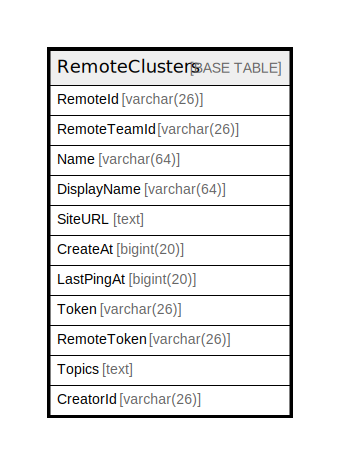

# RemoteClusters

## 概要

<details>
<summary><strong>テーブル定義</strong></summary>

```sql
CREATE TABLE `RemoteClusters` (
  `RemoteId` varchar(26) NOT NULL,
  `RemoteTeamId` varchar(26) DEFAULT NULL,
  `Name` varchar(64) NOT NULL,
  `DisplayName` varchar(64) DEFAULT NULL,
  `SiteURL` text DEFAULT NULL,
  `CreateAt` bigint(20) DEFAULT NULL,
  `LastPingAt` bigint(20) DEFAULT NULL,
  `Token` varchar(26) DEFAULT NULL,
  `RemoteToken` varchar(26) DEFAULT NULL,
  `Topics` text DEFAULT NULL,
  `CreatorId` varchar(26) DEFAULT NULL,
  PRIMARY KEY (`RemoteId`,`Name`),
  UNIQUE KEY `remote_clusters_site_url_unique` (`RemoteTeamId`,`SiteURL`(168))
) ENGINE=InnoDB DEFAULT CHARSET=utf8mb4
```

</details>

## カラム一覧

| 名前           | タイプ         | デフォルト値       | NULL許可   | 子テーブル      | 親テーブル      | コメント     |
| ------------ | ----------- | ------------ | -------- | ---------- | ---------- | -------- |
| RemoteId     | varchar(26) |              | false    |            |            |          |
| RemoteTeamId | varchar(26) | NULL         | true     |            |            |          |
| Name         | varchar(64) |              | false    |            |            |          |
| DisplayName  | varchar(64) | NULL         | true     |            |            |          |
| SiteURL      | text        | NULL         | true     |            |            |          |
| CreateAt     | bigint(20)  | NULL         | true     |            |            |          |
| LastPingAt   | bigint(20)  | NULL         | true     |            |            |          |
| Token        | varchar(26) | NULL         | true     |            |            |          |
| RemoteToken  | varchar(26) | NULL         | true     |            |            |          |
| Topics       | text        | NULL         | true     |            |            |          |
| CreatorId    | varchar(26) | NULL         | true     |            |            |          |

## 制約一覧

| 名前                              | タイプ         | 定義                                                                 |
| ------------------------------- | ----------- | ------------------------------------------------------------------ |
| PRIMARY                         | PRIMARY KEY | PRIMARY KEY (RemoteId, Name)                                       |
| remote_clusters_site_url_unique | UNIQUE      | UNIQUE KEY remote_clusters_site_url_unique (RemoteTeamId, SiteURL) |

## INDEX一覧

| 名前                              | 定義                                                                             |
| ------------------------------- | ------------------------------------------------------------------------------ |
| PRIMARY                         | PRIMARY KEY (RemoteId, Name) USING BTREE                                       |
| remote_clusters_site_url_unique | UNIQUE KEY remote_clusters_site_url_unique (RemoteTeamId, SiteURL) USING BTREE |

## ER図



---

> Generated by [tbls](https://github.com/k1LoW/tbls)
