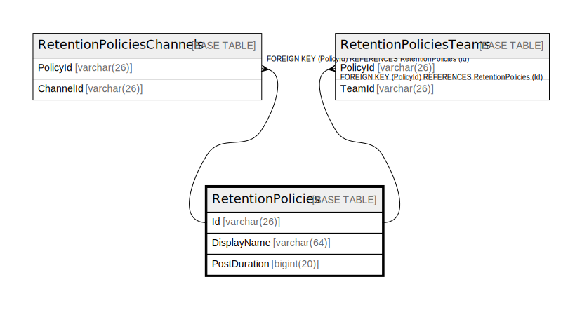

# RetentionPolicies

## 概要

<details>
<summary><strong>テーブル定義</strong></summary>

```sql
CREATE TABLE `RetentionPolicies` (
  `Id` varchar(26) NOT NULL,
  `DisplayName` varchar(64) DEFAULT NULL,
  `PostDuration` bigint(20) DEFAULT NULL,
  PRIMARY KEY (`Id`),
  KEY `IDX_RetentionPolicies_DisplayName` (`DisplayName`)
) ENGINE=InnoDB DEFAULT CHARSET=utf8mb4
```

</details>

## カラム一覧

| 名前           | タイプ         | デフォルト値       | NULL許可   | 子テーブル                                                                                                         | 親テーブル      | コメント     |
| ------------ | ----------- | ------------ | -------- | ------------------------------------------------------------------------------------------------------------- | ---------- | -------- |
| Id           | varchar(26) |              | false    | [RetentionPoliciesChannels](RetentionPoliciesChannels.md) [RetentionPoliciesTeams](RetentionPoliciesTeams.md) |            |          |
| DisplayName  | varchar(64) | NULL         | true     |                                                                                                               |            |          |
| PostDuration | bigint(20)  | NULL         | true     |                                                                                                               |            |          |

## 制約一覧

| 名前      | タイプ         | 定義               |
| ------- | ----------- | ---------------- |
| PRIMARY | PRIMARY KEY | PRIMARY KEY (Id) |

## INDEX一覧

| 名前                                | 定義                                                              |
| --------------------------------- | --------------------------------------------------------------- |
| IDX_RetentionPolicies_DisplayName | KEY IDX_RetentionPolicies_DisplayName (DisplayName) USING BTREE |
| PRIMARY                           | PRIMARY KEY (Id) USING BTREE                                    |

## ER図



---

> Generated by [tbls](https://github.com/k1LoW/tbls)
