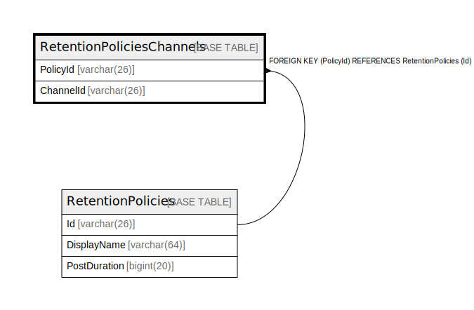

# RetentionPoliciesChannels

## 概要

<details>
<summary><strong>テーブル定義</strong></summary>

```sql
CREATE TABLE `RetentionPoliciesChannels` (
  `PolicyId` varchar(26) DEFAULT NULL,
  `ChannelId` varchar(26) NOT NULL,
  PRIMARY KEY (`ChannelId`),
  KEY `IDX_RetentionPoliciesChannels_PolicyId` (`PolicyId`),
  CONSTRAINT `FK_RetentionPoliciesChannels_RetentionPolicies` FOREIGN KEY (`PolicyId`) REFERENCES `RetentionPolicies` (`Id`) ON DELETE CASCADE
) ENGINE=InnoDB DEFAULT CHARSET=utf8mb4
```

</details>

## カラム一覧

| 名前        | タイプ         | デフォルト値       | NULL許可   | 子テーブル      | 親テーブル                                     | コメント     |
| --------- | ----------- | ------------ | -------- | ---------- | ----------------------------------------- | -------- |
| PolicyId  | varchar(26) | NULL         | true     |            | [RetentionPolicies](RetentionPolicies.md) |          |
| ChannelId | varchar(26) |              | false    |            |                                           |          |

## 制約一覧

| 名前                                             | タイプ         | 定義                                                       |
| ---------------------------------------------- | ----------- | -------------------------------------------------------- |
| FK_RetentionPoliciesChannels_RetentionPolicies | FOREIGN KEY | FOREIGN KEY (PolicyId) REFERENCES RetentionPolicies (Id) |
| PRIMARY                                        | PRIMARY KEY | PRIMARY KEY (ChannelId)                                  |

## INDEX一覧

| 名前                                     | 定義                                                                |
| -------------------------------------- | ----------------------------------------------------------------- |
| IDX_RetentionPoliciesChannels_PolicyId | KEY IDX_RetentionPoliciesChannels_PolicyId (PolicyId) USING BTREE |
| PRIMARY                                | PRIMARY KEY (ChannelId) USING BTREE                               |

## ER図



---

> Generated by [tbls](https://github.com/k1LoW/tbls)
