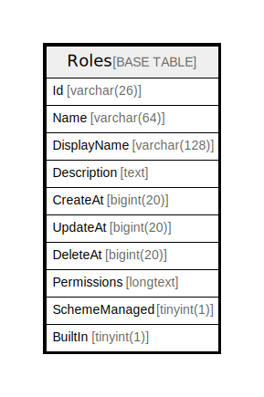

# Roles

## 概要

<details>
<summary><strong>テーブル定義</strong></summary>

```sql
CREATE TABLE `Roles` (
  `Id` varchar(26) NOT NULL,
  `Name` varchar(64) DEFAULT NULL,
  `DisplayName` varchar(128) DEFAULT NULL,
  `Description` text DEFAULT NULL,
  `CreateAt` bigint(20) DEFAULT NULL,
  `UpdateAt` bigint(20) DEFAULT NULL,
  `DeleteAt` bigint(20) DEFAULT NULL,
  `Permissions` longtext DEFAULT NULL,
  `SchemeManaged` tinyint(1) DEFAULT NULL,
  `BuiltIn` tinyint(1) DEFAULT NULL,
  PRIMARY KEY (`Id`),
  UNIQUE KEY `Name` (`Name`)
) ENGINE=InnoDB DEFAULT CHARSET=utf8mb4
```

</details>

## カラム一覧

| 名前            | タイプ          | デフォルト値       | NULL許可   | 子テーブル      | 親テーブル      | コメント     |
| ------------- | ------------ | ------------ | -------- | ---------- | ---------- | -------- |
| Id            | varchar(26)  |              | false    |            |            |          |
| Name          | varchar(64)  | NULL         | true     |            |            |          |
| DisplayName   | varchar(128) | NULL         | true     |            |            |          |
| Description   | text         | NULL         | true     |            |            |          |
| CreateAt      | bigint(20)   | NULL         | true     |            |            |          |
| UpdateAt      | bigint(20)   | NULL         | true     |            |            |          |
| DeleteAt      | bigint(20)   | NULL         | true     |            |            |          |
| Permissions   | longtext     | NULL         | true     |            |            |          |
| SchemeManaged | tinyint(1)   | NULL         | true     |            |            |          |
| BuiltIn       | tinyint(1)   | NULL         | true     |            |            |          |

## 制約一覧

| 名前      | タイプ         | 定義                     |
| ------- | ----------- | ---------------------- |
| Name    | UNIQUE      | UNIQUE KEY Name (Name) |
| PRIMARY | PRIMARY KEY | PRIMARY KEY (Id)       |

## INDEX一覧

| 名前      | 定義                                 |
| ------- | ---------------------------------- |
| PRIMARY | PRIMARY KEY (Id) USING BTREE       |
| Name    | UNIQUE KEY Name (Name) USING BTREE |

## ER図



---

> Generated by [tbls](https://github.com/k1LoW/tbls)
