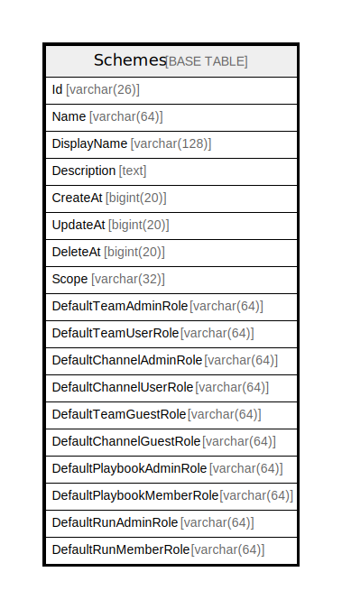

# Schemes

## 概要

<details>
<summary><strong>テーブル定義</strong></summary>

```sql
CREATE TABLE `Schemes` (
  `Id` varchar(26) NOT NULL,
  `Name` varchar(64) DEFAULT NULL,
  `DisplayName` varchar(128) DEFAULT NULL,
  `Description` text DEFAULT NULL,
  `CreateAt` bigint(20) DEFAULT NULL,
  `UpdateAt` bigint(20) DEFAULT NULL,
  `DeleteAt` bigint(20) DEFAULT NULL,
  `Scope` varchar(32) DEFAULT NULL,
  `DefaultTeamAdminRole` varchar(64) DEFAULT NULL,
  `DefaultTeamUserRole` varchar(64) DEFAULT NULL,
  `DefaultChannelAdminRole` varchar(64) DEFAULT NULL,
  `DefaultChannelUserRole` varchar(64) DEFAULT NULL,
  `DefaultTeamGuestRole` varchar(64) DEFAULT NULL,
  `DefaultChannelGuestRole` varchar(64) DEFAULT NULL,
  `DefaultPlaybookAdminRole` varchar(64) DEFAULT '',
  `DefaultPlaybookMemberRole` varchar(64) DEFAULT '',
  `DefaultRunAdminRole` varchar(64) DEFAULT '',
  `DefaultRunMemberRole` varchar(64) DEFAULT '',
  PRIMARY KEY (`Id`),
  UNIQUE KEY `Name` (`Name`),
  KEY `idx_schemes_channel_guest_role` (`DefaultChannelGuestRole`),
  KEY `idx_schemes_channel_user_role` (`DefaultChannelUserRole`),
  KEY `idx_schemes_channel_admin_role` (`DefaultChannelAdminRole`)
) ENGINE=InnoDB DEFAULT CHARSET=utf8mb4
```

</details>

## カラム一覧

| 名前                        | タイプ          | デフォルト値       | NULL許可   | 子テーブル      | 親テーブル      | コメント     |
| ------------------------- | ------------ | ------------ | -------- | ---------- | ---------- | -------- |
| Id                        | varchar(26)  |              | false    |            |            |          |
| Name                      | varchar(64)  | NULL         | true     |            |            |          |
| DisplayName               | varchar(128) | NULL         | true     |            |            |          |
| Description               | text         | NULL         | true     |            |            |          |
| CreateAt                  | bigint(20)   | NULL         | true     |            |            |          |
| UpdateAt                  | bigint(20)   | NULL         | true     |            |            |          |
| DeleteAt                  | bigint(20)   | NULL         | true     |            |            |          |
| Scope                     | varchar(32)  | NULL         | true     |            |            |          |
| DefaultTeamAdminRole      | varchar(64)  | NULL         | true     |            |            |          |
| DefaultTeamUserRole       | varchar(64)  | NULL         | true     |            |            |          |
| DefaultChannelAdminRole   | varchar(64)  | NULL         | true     |            |            |          |
| DefaultChannelUserRole    | varchar(64)  | NULL         | true     |            |            |          |
| DefaultTeamGuestRole      | varchar(64)  | NULL         | true     |            |            |          |
| DefaultChannelGuestRole   | varchar(64)  | NULL         | true     |            |            |          |
| DefaultPlaybookAdminRole  | varchar(64)  | ''           | true     |            |            |          |
| DefaultPlaybookMemberRole | varchar(64)  | ''           | true     |            |            |          |
| DefaultRunAdminRole       | varchar(64)  | ''           | true     |            |            |          |
| DefaultRunMemberRole      | varchar(64)  | ''           | true     |            |            |          |

## 制約一覧

| 名前      | タイプ         | 定義                     |
| ------- | ----------- | ---------------------- |
| Name    | UNIQUE      | UNIQUE KEY Name (Name) |
| PRIMARY | PRIMARY KEY | PRIMARY KEY (Id)       |

## INDEX一覧

| 名前                             | 定義                                                                       |
| ------------------------------ | ------------------------------------------------------------------------ |
| idx_schemes_channel_admin_role | KEY idx_schemes_channel_admin_role (DefaultChannelAdminRole) USING BTREE |
| idx_schemes_channel_guest_role | KEY idx_schemes_channel_guest_role (DefaultChannelGuestRole) USING BTREE |
| idx_schemes_channel_user_role  | KEY idx_schemes_channel_user_role (DefaultChannelUserRole) USING BTREE   |
| PRIMARY                        | PRIMARY KEY (Id) USING BTREE                                             |
| Name                           | UNIQUE KEY Name (Name) USING BTREE                                       |

## ER図



---

> Generated by [tbls](https://github.com/k1LoW/tbls)
