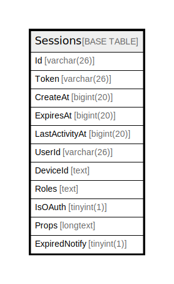

# Sessions

## 概要

<details>
<summary><strong>テーブル定義</strong></summary>

```sql
CREATE TABLE `Sessions` (
  `Id` varchar(26) NOT NULL,
  `Token` varchar(26) DEFAULT NULL,
  `CreateAt` bigint(20) DEFAULT NULL,
  `ExpiresAt` bigint(20) DEFAULT NULL,
  `LastActivityAt` bigint(20) DEFAULT NULL,
  `UserId` varchar(26) DEFAULT NULL,
  `DeviceId` text DEFAULT NULL,
  `Roles` text DEFAULT NULL,
  `IsOAuth` tinyint(1) DEFAULT NULL,
  `Props` longtext CHARACTER SET utf8mb4 COLLATE utf8mb4_bin DEFAULT NULL CHECK (json_valid(`Props`)),
  `ExpiredNotify` tinyint(1) DEFAULT NULL,
  PRIMARY KEY (`Id`),
  KEY `idx_sessions_user_id` (`UserId`),
  KEY `idx_sessions_token` (`Token`),
  KEY `idx_sessions_expires_at` (`ExpiresAt`),
  KEY `idx_sessions_create_at` (`CreateAt`),
  KEY `idx_sessions_last_activity_at` (`LastActivityAt`)
) ENGINE=InnoDB DEFAULT CHARSET=utf8mb4
```

</details>

## カラム一覧

| 名前             | タイプ         | デフォルト値       | NULL許可   | 子テーブル      | 親テーブル      | コメント     |
| -------------- | ----------- | ------------ | -------- | ---------- | ---------- | -------- |
| Id             | varchar(26) |              | false    |            |            |          |
| Token          | varchar(26) | NULL         | true     |            |            |          |
| CreateAt       | bigint(20)  | NULL         | true     |            |            |          |
| ExpiresAt      | bigint(20)  | NULL         | true     |            |            |          |
| LastActivityAt | bigint(20)  | NULL         | true     |            |            |          |
| UserId         | varchar(26) | NULL         | true     |            |            |          |
| DeviceId       | text        | NULL         | true     |            |            |          |
| Roles          | text        | NULL         | true     |            |            |          |
| IsOAuth        | tinyint(1)  | NULL         | true     |            |            |          |
| Props          | longtext    | NULL         | true     |            |            |          |
| ExpiredNotify  | tinyint(1)  | NULL         | true     |            |            |          |

## 制約一覧

| 名前      | タイプ         | 定義               |
| ------- | ----------- | ---------------- |
| PRIMARY | PRIMARY KEY | PRIMARY KEY (Id) |

## INDEX一覧

| 名前                            | 定義                                                             |
| ----------------------------- | -------------------------------------------------------------- |
| idx_sessions_create_at        | KEY idx_sessions_create_at (CreateAt) USING BTREE              |
| idx_sessions_expires_at       | KEY idx_sessions_expires_at (ExpiresAt) USING BTREE            |
| idx_sessions_last_activity_at | KEY idx_sessions_last_activity_at (LastActivityAt) USING BTREE |
| idx_sessions_token            | KEY idx_sessions_token (Token) USING BTREE                     |
| idx_sessions_user_id          | KEY idx_sessions_user_id (UserId) USING BTREE                  |
| PRIMARY                       | PRIMARY KEY (Id) USING BTREE                                   |

## ER図



---

> Generated by [tbls](https://github.com/k1LoW/tbls)
