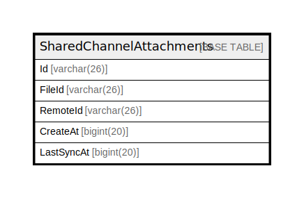

# SharedChannelAttachments

## 概要

<details>
<summary><strong>テーブル定義</strong></summary>

```sql
CREATE TABLE `SharedChannelAttachments` (
  `Id` varchar(26) NOT NULL,
  `FileId` varchar(26) DEFAULT NULL,
  `RemoteId` varchar(26) DEFAULT NULL,
  `CreateAt` bigint(20) DEFAULT NULL,
  `LastSyncAt` bigint(20) DEFAULT NULL,
  PRIMARY KEY (`Id`),
  UNIQUE KEY `FileId` (`FileId`,`RemoteId`)
) ENGINE=InnoDB DEFAULT CHARSET=utf8mb4
```

</details>

## カラム一覧

| 名前         | タイプ         | デフォルト値       | NULL許可   | 子テーブル      | 親テーブル      | コメント     |
| ---------- | ----------- | ------------ | -------- | ---------- | ---------- | -------- |
| Id         | varchar(26) |              | false    |            |            |          |
| FileId     | varchar(26) | NULL         | true     |            |            |          |
| RemoteId   | varchar(26) | NULL         | true     |            |            |          |
| CreateAt   | bigint(20)  | NULL         | true     |            |            |          |
| LastSyncAt | bigint(20)  | NULL         | true     |            |            |          |

## 制約一覧

| 名前      | タイプ         | 定義                                   |
| ------- | ----------- | ------------------------------------ |
| FileId  | UNIQUE      | UNIQUE KEY FileId (FileId, RemoteId) |
| PRIMARY | PRIMARY KEY | PRIMARY KEY (Id)                     |

## INDEX一覧

| 名前      | 定義                                               |
| ------- | ------------------------------------------------ |
| PRIMARY | PRIMARY KEY (Id) USING BTREE                     |
| FileId  | UNIQUE KEY FileId (FileId, RemoteId) USING BTREE |

## ER図



---

> Generated by [tbls](https://github.com/k1LoW/tbls)
