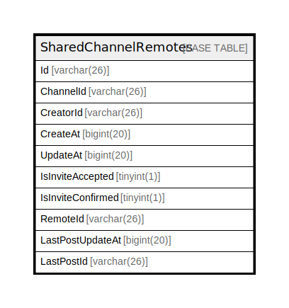

# SharedChannelRemotes

## 概要

<details>
<summary><strong>テーブル定義</strong></summary>

```sql
CREATE TABLE `SharedChannelRemotes` (
  `Id` varchar(26) NOT NULL,
  `ChannelId` varchar(26) NOT NULL,
  `CreatorId` varchar(26) DEFAULT NULL,
  `CreateAt` bigint(20) DEFAULT NULL,
  `UpdateAt` bigint(20) DEFAULT NULL,
  `IsInviteAccepted` tinyint(1) DEFAULT NULL,
  `IsInviteConfirmed` tinyint(1) DEFAULT NULL,
  `RemoteId` varchar(26) DEFAULT NULL,
  `LastPostUpdateAt` bigint(20) DEFAULT NULL,
  `LastPostId` varchar(26) DEFAULT NULL,
  PRIMARY KEY (`Id`,`ChannelId`),
  UNIQUE KEY `ChannelId` (`ChannelId`,`RemoteId`)
) ENGINE=InnoDB DEFAULT CHARSET=utf8mb4
```

</details>

## カラム一覧

| 名前                | タイプ         | デフォルト値       | NULL許可   | 子テーブル      | 親テーブル      | コメント     |
| ----------------- | ----------- | ------------ | -------- | ---------- | ---------- | -------- |
| Id                | varchar(26) |              | false    |            |            |          |
| ChannelId         | varchar(26) |              | false    |            |            |          |
| CreatorId         | varchar(26) | NULL         | true     |            |            |          |
| CreateAt          | bigint(20)  | NULL         | true     |            |            |          |
| UpdateAt          | bigint(20)  | NULL         | true     |            |            |          |
| IsInviteAccepted  | tinyint(1)  | NULL         | true     |            |            |          |
| IsInviteConfirmed | tinyint(1)  | NULL         | true     |            |            |          |
| RemoteId          | varchar(26) | NULL         | true     |            |            |          |
| LastPostUpdateAt  | bigint(20)  | NULL         | true     |            |            |          |
| LastPostId        | varchar(26) | NULL         | true     |            |            |          |

## 制約一覧

| 名前        | タイプ         | 定義                                         |
| --------- | ----------- | ------------------------------------------ |
| ChannelId | UNIQUE      | UNIQUE KEY ChannelId (ChannelId, RemoteId) |
| PRIMARY   | PRIMARY KEY | PRIMARY KEY (Id, ChannelId)                |

## INDEX一覧

| 名前        | 定義                                                     |
| --------- | ------------------------------------------------------ |
| PRIMARY   | PRIMARY KEY (Id, ChannelId) USING BTREE                |
| ChannelId | UNIQUE KEY ChannelId (ChannelId, RemoteId) USING BTREE |

## ER図



---

> Generated by [tbls](https://github.com/k1LoW/tbls)
