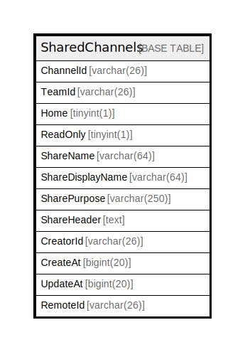

# SharedChannels

## 概要

<details>
<summary><strong>テーブル定義</strong></summary>

```sql
CREATE TABLE `SharedChannels` (
  `ChannelId` varchar(26) NOT NULL,
  `TeamId` varchar(26) DEFAULT NULL,
  `Home` tinyint(1) DEFAULT NULL,
  `ReadOnly` tinyint(1) DEFAULT NULL,
  `ShareName` varchar(64) DEFAULT NULL,
  `ShareDisplayName` varchar(64) DEFAULT NULL,
  `SharePurpose` varchar(250) DEFAULT NULL,
  `ShareHeader` text DEFAULT NULL,
  `CreatorId` varchar(26) DEFAULT NULL,
  `CreateAt` bigint(20) DEFAULT NULL,
  `UpdateAt` bigint(20) DEFAULT NULL,
  `RemoteId` varchar(26) DEFAULT NULL,
  PRIMARY KEY (`ChannelId`),
  UNIQUE KEY `ShareName` (`ShareName`,`TeamId`)
) ENGINE=InnoDB DEFAULT CHARSET=utf8mb4
```

</details>

## カラム一覧

| 名前               | タイプ          | デフォルト値       | NULL許可   | 子テーブル      | 親テーブル      | コメント     |
| ---------------- | ------------ | ------------ | -------- | ---------- | ---------- | -------- |
| ChannelId        | varchar(26)  |              | false    |            |            |          |
| TeamId           | varchar(26)  | NULL         | true     |            |            |          |
| Home             | tinyint(1)   | NULL         | true     |            |            |          |
| ReadOnly         | tinyint(1)   | NULL         | true     |            |            |          |
| ShareName        | varchar(64)  | NULL         | true     |            |            |          |
| ShareDisplayName | varchar(64)  | NULL         | true     |            |            |          |
| SharePurpose     | varchar(250) | NULL         | true     |            |            |          |
| ShareHeader      | text         | NULL         | true     |            |            |          |
| CreatorId        | varchar(26)  | NULL         | true     |            |            |          |
| CreateAt         | bigint(20)   | NULL         | true     |            |            |          |
| UpdateAt         | bigint(20)   | NULL         | true     |            |            |          |
| RemoteId         | varchar(26)  | NULL         | true     |            |            |          |

## 制約一覧

| 名前        | タイプ         | 定義                                       |
| --------- | ----------- | ---------------------------------------- |
| PRIMARY   | PRIMARY KEY | PRIMARY KEY (ChannelId)                  |
| ShareName | UNIQUE      | UNIQUE KEY ShareName (ShareName, TeamId) |

## INDEX一覧

| 名前        | 定義                                                   |
| --------- | ---------------------------------------------------- |
| PRIMARY   | PRIMARY KEY (ChannelId) USING BTREE                  |
| ShareName | UNIQUE KEY ShareName (ShareName, TeamId) USING BTREE |

## ER図



---

> Generated by [tbls](https://github.com/k1LoW/tbls)
