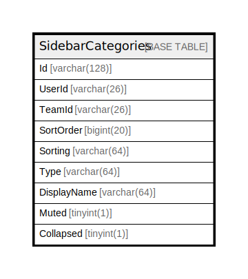

# SidebarCategories

## 概要

<details>
<summary><strong>テーブル定義</strong></summary>

```sql
CREATE TABLE `SidebarCategories` (
  `Id` varchar(128) NOT NULL,
  `UserId` varchar(26) DEFAULT NULL,
  `TeamId` varchar(26) DEFAULT NULL,
  `SortOrder` bigint(20) DEFAULT NULL,
  `Sorting` varchar(64) DEFAULT NULL,
  `Type` varchar(64) DEFAULT NULL,
  `DisplayName` varchar(64) DEFAULT NULL,
  `Muted` tinyint(1) DEFAULT NULL,
  `Collapsed` tinyint(1) DEFAULT NULL,
  PRIMARY KEY (`Id`),
  KEY `idx_sidebarcategories_userid_teamid` (`UserId`,`TeamId`)
) ENGINE=InnoDB DEFAULT CHARSET=utf8mb4
```

</details>

## カラム一覧

| 名前          | タイプ          | デフォルト値       | NULL許可   | 子テーブル      | 親テーブル      | コメント     |
| ----------- | ------------ | ------------ | -------- | ---------- | ---------- | -------- |
| Id          | varchar(128) |              | false    |            |            |          |
| UserId      | varchar(26)  | NULL         | true     |            |            |          |
| TeamId      | varchar(26)  | NULL         | true     |            |            |          |
| SortOrder   | bigint(20)   | NULL         | true     |            |            |          |
| Sorting     | varchar(64)  | NULL         | true     |            |            |          |
| Type        | varchar(64)  | NULL         | true     |            |            |          |
| DisplayName | varchar(64)  | NULL         | true     |            |            |          |
| Muted       | tinyint(1)   | NULL         | true     |            |            |          |
| Collapsed   | tinyint(1)   | NULL         | true     |            |            |          |

## 制約一覧

| 名前      | タイプ         | 定義               |
| ------- | ----------- | ---------------- |
| PRIMARY | PRIMARY KEY | PRIMARY KEY (Id) |

## INDEX一覧

| 名前                                  | 定義                                                                   |
| ----------------------------------- | -------------------------------------------------------------------- |
| idx_sidebarcategories_userid_teamid | KEY idx_sidebarcategories_userid_teamid (UserId, TeamId) USING BTREE |
| PRIMARY                             | PRIMARY KEY (Id) USING BTREE                                         |

## ER図



---

> Generated by [tbls](https://github.com/k1LoW/tbls)
