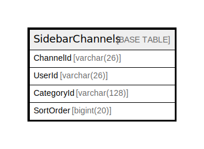

# SidebarChannels

## 概要

<details>
<summary><strong>テーブル定義</strong></summary>

```sql
CREATE TABLE `SidebarChannels` (
  `ChannelId` varchar(26) NOT NULL,
  `UserId` varchar(26) NOT NULL,
  `CategoryId` varchar(128) NOT NULL,
  `SortOrder` bigint(20) DEFAULT NULL,
  PRIMARY KEY (`ChannelId`,`UserId`,`CategoryId`)
) ENGINE=InnoDB DEFAULT CHARSET=utf8mb4
```

</details>

## カラム一覧

| 名前         | タイプ          | デフォルト値       | NULL許可   | 子テーブル      | 親テーブル      | コメント     |
| ---------- | ------------ | ------------ | -------- | ---------- | ---------- | -------- |
| ChannelId  | varchar(26)  |              | false    |            |            |          |
| UserId     | varchar(26)  |              | false    |            |            |          |
| CategoryId | varchar(128) |              | false    |            |            |          |
| SortOrder  | bigint(20)   | NULL         | true     |            |            |          |

## 制約一覧

| 名前      | タイプ         | 定義                                          |
| ------- | ----------- | ------------------------------------------- |
| PRIMARY | PRIMARY KEY | PRIMARY KEY (ChannelId, UserId, CategoryId) |

## INDEX一覧

| 名前      | 定義                                                      |
| ------- | ------------------------------------------------------- |
| PRIMARY | PRIMARY KEY (ChannelId, UserId, CategoryId) USING BTREE |

## ER図



---

> Generated by [tbls](https://github.com/k1LoW/tbls)
