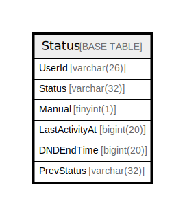

# Status

## 概要

<details>
<summary><strong>テーブル定義</strong></summary>

```sql
CREATE TABLE `Status` (
  `UserId` varchar(26) NOT NULL,
  `Status` varchar(32) DEFAULT NULL,
  `Manual` tinyint(1) DEFAULT NULL,
  `LastActivityAt` bigint(20) DEFAULT NULL,
  `DNDEndTime` bigint(20) DEFAULT NULL,
  `PrevStatus` varchar(32) DEFAULT NULL,
  PRIMARY KEY (`UserId`),
  KEY `idx_status_status_dndendtime` (`Status`,`DNDEndTime`)
) ENGINE=InnoDB DEFAULT CHARSET=utf8mb4
```

</details>

## カラム一覧

| 名前             | タイプ         | デフォルト値       | NULL許可   | 子テーブル      | 親テーブル      | コメント     |
| -------------- | ----------- | ------------ | -------- | ---------- | ---------- | -------- |
| UserId         | varchar(26) |              | false    |            |            |          |
| Status         | varchar(32) | NULL         | true     |            |            |          |
| Manual         | tinyint(1)  | NULL         | true     |            |            |          |
| LastActivityAt | bigint(20)  | NULL         | true     |            |            |          |
| DNDEndTime     | bigint(20)  | NULL         | true     |            |            |          |
| PrevStatus     | varchar(32) | NULL         | true     |            |            |          |

## 制約一覧

| 名前      | タイプ         | 定義                   |
| ------- | ----------- | -------------------- |
| PRIMARY | PRIMARY KEY | PRIMARY KEY (UserId) |

## INDEX一覧

| 名前                           | 定義                                                                |
| ---------------------------- | ----------------------------------------------------------------- |
| idx_status_status_dndendtime | KEY idx_status_status_dndendtime (Status, DNDEndTime) USING BTREE |
| PRIMARY                      | PRIMARY KEY (UserId) USING BTREE                                  |

## ER図



---

> Generated by [tbls](https://github.com/k1LoW/tbls)
