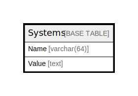

# Systems

## 概要

<details>
<summary><strong>テーブル定義</strong></summary>

```sql
CREATE TABLE `Systems` (
  `Name` varchar(64) NOT NULL,
  `Value` text DEFAULT NULL,
  PRIMARY KEY (`Name`)
) ENGINE=InnoDB DEFAULT CHARSET=utf8mb4
```

</details>

## カラム一覧

| 名前    | タイプ         | デフォルト値       | NULL許可   | 子テーブル      | 親テーブル      | コメント     |
| ----- | ----------- | ------------ | -------- | ---------- | ---------- | -------- |
| Name  | varchar(64) |              | false    |            |            |          |
| Value | text        | NULL         | true     |            |            |          |

## 制約一覧

| 名前      | タイプ         | 定義                 |
| ------- | ----------- | ------------------ |
| PRIMARY | PRIMARY KEY | PRIMARY KEY (Name) |

## INDEX一覧

| 名前      | 定義                             |
| ------- | ------------------------------ |
| PRIMARY | PRIMARY KEY (Name) USING BTREE |

## ER図



---

> Generated by [tbls](https://github.com/k1LoW/tbls)
