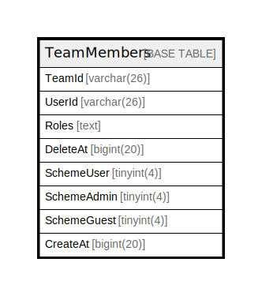

# TeamMembers

## 概要

<details>
<summary><strong>テーブル定義</strong></summary>

```sql
CREATE TABLE `TeamMembers` (
  `TeamId` varchar(26) NOT NULL,
  `UserId` varchar(26) NOT NULL,
  `Roles` text DEFAULT NULL,
  `DeleteAt` bigint(20) DEFAULT NULL,
  `SchemeUser` tinyint(4) DEFAULT NULL,
  `SchemeAdmin` tinyint(4) DEFAULT NULL,
  `SchemeGuest` tinyint(4) DEFAULT NULL,
  `CreateAt` bigint(20) DEFAULT 0,
  PRIMARY KEY (`TeamId`,`UserId`),
  KEY `idx_teammembers_user_id` (`UserId`),
  KEY `idx_teammembers_delete_at` (`DeleteAt`),
  KEY `idx_teammembers_createat` (`CreateAt`)
) ENGINE=InnoDB DEFAULT CHARSET=utf8mb4
```

</details>

## カラム一覧

| 名前          | タイプ         | デフォルト値       | NULL許可   | 子テーブル      | 親テーブル      | コメント     |
| ----------- | ----------- | ------------ | -------- | ---------- | ---------- | -------- |
| TeamId      | varchar(26) |              | false    |            |            |          |
| UserId      | varchar(26) |              | false    |            |            |          |
| Roles       | text        | NULL         | true     |            |            |          |
| DeleteAt    | bigint(20)  | NULL         | true     |            |            |          |
| SchemeUser  | tinyint(4)  | NULL         | true     |            |            |          |
| SchemeAdmin | tinyint(4)  | NULL         | true     |            |            |          |
| SchemeGuest | tinyint(4)  | NULL         | true     |            |            |          |
| CreateAt    | bigint(20)  | 0            | true     |            |            |          |

## 制約一覧

| 名前      | タイプ         | 定義                           |
| ------- | ----------- | ---------------------------- |
| PRIMARY | PRIMARY KEY | PRIMARY KEY (TeamId, UserId) |

## INDEX一覧

| 名前                        | 定義                                                   |
| ------------------------- | ---------------------------------------------------- |
| idx_teammembers_createat  | KEY idx_teammembers_createat (CreateAt) USING BTREE  |
| idx_teammembers_delete_at | KEY idx_teammembers_delete_at (DeleteAt) USING BTREE |
| idx_teammembers_user_id   | KEY idx_teammembers_user_id (UserId) USING BTREE     |
| PRIMARY                   | PRIMARY KEY (TeamId, UserId) USING BTREE             |

## ER図



---

> Generated by [tbls](https://github.com/k1LoW/tbls)
