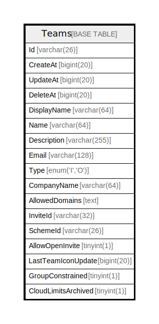

# Teams

## 概要

<details>
<summary><strong>テーブル定義</strong></summary>

```sql
CREATE TABLE `Teams` (
  `Id` varchar(26) NOT NULL,
  `CreateAt` bigint(20) DEFAULT NULL,
  `UpdateAt` bigint(20) DEFAULT NULL,
  `DeleteAt` bigint(20) DEFAULT NULL,
  `DisplayName` varchar(64) DEFAULT NULL,
  `Name` varchar(64) DEFAULT NULL,
  `Description` varchar(255) DEFAULT NULL,
  `Email` varchar(128) DEFAULT NULL,
  `Type` enum('I','O') DEFAULT NULL,
  `CompanyName` varchar(64) DEFAULT NULL,
  `AllowedDomains` text DEFAULT NULL,
  `InviteId` varchar(32) DEFAULT NULL,
  `SchemeId` varchar(26) DEFAULT NULL,
  `AllowOpenInvite` tinyint(1) DEFAULT NULL,
  `LastTeamIconUpdate` bigint(20) DEFAULT NULL,
  `GroupConstrained` tinyint(1) DEFAULT NULL,
  `CloudLimitsArchived` tinyint(1) NOT NULL DEFAULT 0,
  PRIMARY KEY (`Id`),
  UNIQUE KEY `Name` (`Name`),
  KEY `idx_teams_invite_id` (`InviteId`),
  KEY `idx_teams_update_at` (`UpdateAt`),
  KEY `idx_teams_create_at` (`CreateAt`),
  KEY `idx_teams_delete_at` (`DeleteAt`),
  KEY `idx_teams_scheme_id` (`SchemeId`)
) ENGINE=InnoDB DEFAULT CHARSET=utf8mb4
```

</details>

## カラム一覧

| 名前                  | タイプ           | デフォルト値       | NULL許可   | 子テーブル      | 親テーブル      | コメント     |
| ------------------- | ------------- | ------------ | -------- | ---------- | ---------- | -------- |
| Id                  | varchar(26)   |              | false    |            |            |          |
| CreateAt            | bigint(20)    | NULL         | true     |            |            |          |
| UpdateAt            | bigint(20)    | NULL         | true     |            |            |          |
| DeleteAt            | bigint(20)    | NULL         | true     |            |            |          |
| DisplayName         | varchar(64)   | NULL         | true     |            |            |          |
| Name                | varchar(64)   | NULL         | true     |            |            |          |
| Description         | varchar(255)  | NULL         | true     |            |            |          |
| Email               | varchar(128)  | NULL         | true     |            |            |          |
| Type                | enum('I','O') | NULL         | true     |            |            |          |
| CompanyName         | varchar(64)   | NULL         | true     |            |            |          |
| AllowedDomains      | text          | NULL         | true     |            |            |          |
| InviteId            | varchar(32)   | NULL         | true     |            |            |          |
| SchemeId            | varchar(26)   | NULL         | true     |            |            |          |
| AllowOpenInvite     | tinyint(1)    | NULL         | true     |            |            |          |
| LastTeamIconUpdate  | bigint(20)    | NULL         | true     |            |            |          |
| GroupConstrained    | tinyint(1)    | NULL         | true     |            |            |          |
| CloudLimitsArchived | tinyint(1)    | 0            | false    |            |            |          |

## 制約一覧

| 名前      | タイプ         | 定義                     |
| ------- | ----------- | ---------------------- |
| Name    | UNIQUE      | UNIQUE KEY Name (Name) |
| PRIMARY | PRIMARY KEY | PRIMARY KEY (Id)       |

## INDEX一覧

| 名前                  | 定義                                             |
| ------------------- | ---------------------------------------------- |
| idx_teams_create_at | KEY idx_teams_create_at (CreateAt) USING BTREE |
| idx_teams_delete_at | KEY idx_teams_delete_at (DeleteAt) USING BTREE |
| idx_teams_invite_id | KEY idx_teams_invite_id (InviteId) USING BTREE |
| idx_teams_scheme_id | KEY idx_teams_scheme_id (SchemeId) USING BTREE |
| idx_teams_update_at | KEY idx_teams_update_at (UpdateAt) USING BTREE |
| PRIMARY             | PRIMARY KEY (Id) USING BTREE                   |
| Name                | UNIQUE KEY Name (Name) USING BTREE             |

## ER図



---

> Generated by [tbls](https://github.com/k1LoW/tbls)
