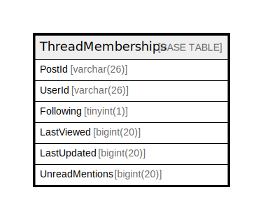

# ThreadMemberships

## 概要

<details>
<summary><strong>テーブル定義</strong></summary>

```sql
CREATE TABLE `ThreadMemberships` (
  `PostId` varchar(26) NOT NULL,
  `UserId` varchar(26) NOT NULL,
  `Following` tinyint(1) DEFAULT NULL,
  `LastViewed` bigint(20) DEFAULT NULL,
  `LastUpdated` bigint(20) DEFAULT NULL,
  `UnreadMentions` bigint(20) DEFAULT NULL,
  PRIMARY KEY (`PostId`,`UserId`),
  KEY `idx_thread_memberships_last_update_at` (`LastUpdated`),
  KEY `idx_thread_memberships_last_view_at` (`LastViewed`),
  KEY `idx_thread_memberships_user_id` (`UserId`)
) ENGINE=InnoDB DEFAULT CHARSET=utf8mb4
```

</details>

## カラム一覧

| 名前             | タイプ         | デフォルト値       | NULL許可   | 子テーブル      | 親テーブル      | コメント     |
| -------------- | ----------- | ------------ | -------- | ---------- | ---------- | -------- |
| PostId         | varchar(26) |              | false    |            |            |          |
| UserId         | varchar(26) |              | false    |            |            |          |
| Following      | tinyint(1)  | NULL         | true     |            |            |          |
| LastViewed     | bigint(20)  | NULL         | true     |            |            |          |
| LastUpdated    | bigint(20)  | NULL         | true     |            |            |          |
| UnreadMentions | bigint(20)  | NULL         | true     |            |            |          |

## 制約一覧

| 名前      | タイプ         | 定義                           |
| ------- | ----------- | ---------------------------- |
| PRIMARY | PRIMARY KEY | PRIMARY KEY (PostId, UserId) |

## INDEX一覧

| 名前                                    | 定義                                                                  |
| ------------------------------------- | ------------------------------------------------------------------- |
| idx_thread_memberships_last_update_at | KEY idx_thread_memberships_last_update_at (LastUpdated) USING BTREE |
| idx_thread_memberships_last_view_at   | KEY idx_thread_memberships_last_view_at (LastViewed) USING BTREE    |
| idx_thread_memberships_user_id        | KEY idx_thread_memberships_user_id (UserId) USING BTREE             |
| PRIMARY                               | PRIMARY KEY (PostId, UserId) USING BTREE                            |

## ER図



---

> Generated by [tbls](https://github.com/k1LoW/tbls)
