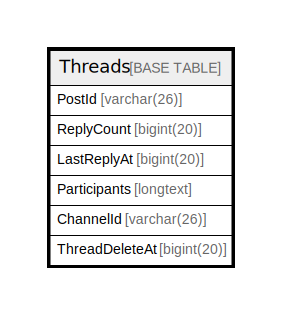

# Threads

## 概要

<details>
<summary><strong>テーブル定義</strong></summary>

```sql
CREATE TABLE `Threads` (
  `PostId` varchar(26) NOT NULL,
  `ReplyCount` bigint(20) DEFAULT NULL,
  `LastReplyAt` bigint(20) DEFAULT NULL,
  `Participants` longtext CHARACTER SET utf8mb4 COLLATE utf8mb4_bin DEFAULT NULL CHECK (json_valid(`Participants`)),
  `ChannelId` varchar(26) DEFAULT NULL,
  `ThreadDeleteAt` bigint(20) DEFAULT NULL,
  PRIMARY KEY (`PostId`),
  KEY `idx_threads_channel_id_last_reply_at` (`ChannelId`,`LastReplyAt`)
) ENGINE=InnoDB DEFAULT CHARSET=utf8mb4
```

</details>

## カラム一覧

| 名前             | タイプ         | デフォルト値       | NULL許可   | 子テーブル      | 親テーブル      | コメント     |
| -------------- | ----------- | ------------ | -------- | ---------- | ---------- | -------- |
| PostId         | varchar(26) |              | false    |            |            |          |
| ReplyCount     | bigint(20)  | NULL         | true     |            |            |          |
| LastReplyAt    | bigint(20)  | NULL         | true     |            |            |          |
| Participants   | longtext    | NULL         | true     |            |            |          |
| ChannelId      | varchar(26) | NULL         | true     |            |            |          |
| ThreadDeleteAt | bigint(20)  | NULL         | true     |            |            |          |

## 制約一覧

| 名前      | タイプ         | 定義                   |
| ------- | ----------- | -------------------- |
| PRIMARY | PRIMARY KEY | PRIMARY KEY (PostId) |

## INDEX一覧

| 名前                                   | 定義                                                                            |
| ------------------------------------ | ----------------------------------------------------------------------------- |
| idx_threads_channel_id_last_reply_at | KEY idx_threads_channel_id_last_reply_at (ChannelId, LastReplyAt) USING BTREE |
| PRIMARY                              | PRIMARY KEY (PostId) USING BTREE                                              |

## ER図



---

> Generated by [tbls](https://github.com/k1LoW/tbls)
