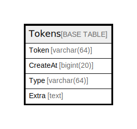

# Tokens

## 概要

<details>
<summary><strong>テーブル定義</strong></summary>

```sql
CREATE TABLE `Tokens` (
  `Token` varchar(64) NOT NULL,
  `CreateAt` bigint(20) DEFAULT NULL,
  `Type` varchar(64) DEFAULT NULL,
  `Extra` text DEFAULT NULL,
  PRIMARY KEY (`Token`)
) ENGINE=InnoDB DEFAULT CHARSET=utf8mb4
```

</details>

## カラム一覧

| 名前       | タイプ         | デフォルト値       | NULL許可   | 子テーブル      | 親テーブル      | コメント     |
| -------- | ----------- | ------------ | -------- | ---------- | ---------- | -------- |
| Token    | varchar(64) |              | false    |            |            |          |
| CreateAt | bigint(20)  | NULL         | true     |            |            |          |
| Type     | varchar(64) | NULL         | true     |            |            |          |
| Extra    | text        | NULL         | true     |            |            |          |

## 制約一覧

| 名前      | タイプ         | 定義                  |
| ------- | ----------- | ------------------- |
| PRIMARY | PRIMARY KEY | PRIMARY KEY (Token) |

## INDEX一覧

| 名前      | 定義                              |
| ------- | ------------------------------- |
| PRIMARY | PRIMARY KEY (Token) USING BTREE |

## ER図



---

> Generated by [tbls](https://github.com/k1LoW/tbls)
