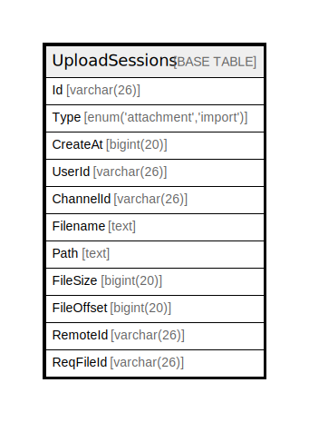

# UploadSessions

## 概要

<details>
<summary><strong>テーブル定義</strong></summary>

```sql
CREATE TABLE `UploadSessions` (
  `Id` varchar(26) NOT NULL,
  `Type` enum('attachment','import') DEFAULT NULL,
  `CreateAt` bigint(20) DEFAULT NULL,
  `UserId` varchar(26) DEFAULT NULL,
  `ChannelId` varchar(26) DEFAULT NULL,
  `Filename` text DEFAULT NULL,
  `Path` text DEFAULT NULL,
  `FileSize` bigint(20) DEFAULT NULL,
  `FileOffset` bigint(20) DEFAULT NULL,
  `RemoteId` varchar(26) DEFAULT NULL,
  `ReqFileId` varchar(26) DEFAULT NULL,
  PRIMARY KEY (`Id`),
  KEY `idx_uploadsessions_user_id` (`UserId`),
  KEY `idx_uploadsessions_create_at` (`CreateAt`),
  KEY `idx_uploadsessions_type` (`Type`)
) ENGINE=InnoDB DEFAULT CHARSET=utf8mb4
```

</details>

## カラム一覧

| 名前         | タイプ                         | デフォルト値       | NULL許可   | 子テーブル      | 親テーブル      | コメント     |
| ---------- | --------------------------- | ------------ | -------- | ---------- | ---------- | -------- |
| Id         | varchar(26)                 |              | false    |            |            |          |
| Type       | enum('attachment','import') | NULL         | true     |            |            |          |
| CreateAt   | bigint(20)                  | NULL         | true     |            |            |          |
| UserId     | varchar(26)                 | NULL         | true     |            |            |          |
| ChannelId  | varchar(26)                 | NULL         | true     |            |            |          |
| Filename   | text                        | NULL         | true     |            |            |          |
| Path       | text                        | NULL         | true     |            |            |          |
| FileSize   | bigint(20)                  | NULL         | true     |            |            |          |
| FileOffset | bigint(20)                  | NULL         | true     |            |            |          |
| RemoteId   | varchar(26)                 | NULL         | true     |            |            |          |
| ReqFileId  | varchar(26)                 | NULL         | true     |            |            |          |

## 制約一覧

| 名前      | タイプ         | 定義               |
| ------- | ----------- | ---------------- |
| PRIMARY | PRIMARY KEY | PRIMARY KEY (Id) |

## INDEX一覧

| 名前                           | 定義                                                      |
| ---------------------------- | ------------------------------------------------------- |
| idx_uploadsessions_create_at | KEY idx_uploadsessions_create_at (CreateAt) USING BTREE |
| idx_uploadsessions_type      | KEY idx_uploadsessions_type (Type) USING BTREE          |
| idx_uploadsessions_user_id   | KEY idx_uploadsessions_user_id (UserId) USING BTREE     |
| PRIMARY                      | PRIMARY KEY (Id) USING BTREE                            |

## ER図



---

> Generated by [tbls](https://github.com/k1LoW/tbls)
