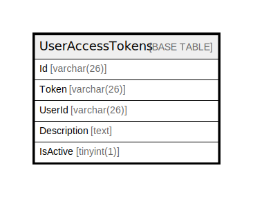

# UserAccessTokens

## 概要

<details>
<summary><strong>テーブル定義</strong></summary>

```sql
CREATE TABLE `UserAccessTokens` (
  `Id` varchar(26) NOT NULL,
  `Token` varchar(26) DEFAULT NULL,
  `UserId` varchar(26) DEFAULT NULL,
  `Description` text DEFAULT NULL,
  `IsActive` tinyint(1) DEFAULT NULL,
  PRIMARY KEY (`Id`),
  UNIQUE KEY `Token` (`Token`),
  KEY `idx_user_access_tokens_user_id` (`UserId`)
) ENGINE=InnoDB DEFAULT CHARSET=utf8mb4
```

</details>

## カラム一覧

| 名前          | タイプ         | デフォルト値       | NULL許可   | 子テーブル      | 親テーブル      | コメント     |
| ----------- | ----------- | ------------ | -------- | ---------- | ---------- | -------- |
| Id          | varchar(26) |              | false    |            |            |          |
| Token       | varchar(26) | NULL         | true     |            |            |          |
| UserId      | varchar(26) | NULL         | true     |            |            |          |
| Description | text        | NULL         | true     |            |            |          |
| IsActive    | tinyint(1)  | NULL         | true     |            |            |          |

## 制約一覧

| 名前      | タイプ         | 定義                       |
| ------- | ----------- | ------------------------ |
| PRIMARY | PRIMARY KEY | PRIMARY KEY (Id)         |
| Token   | UNIQUE      | UNIQUE KEY Token (Token) |

## INDEX一覧

| 名前                             | 定義                                                      |
| ------------------------------ | ------------------------------------------------------- |
| idx_user_access_tokens_user_id | KEY idx_user_access_tokens_user_id (UserId) USING BTREE |
| PRIMARY                        | PRIMARY KEY (Id) USING BTREE                            |
| Token                          | UNIQUE KEY Token (Token) USING BTREE                    |

## ER図



---

> Generated by [tbls](https://github.com/k1LoW/tbls)
