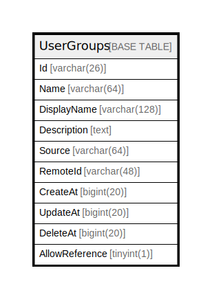

# UserGroups

## 概要

<details>
<summary><strong>テーブル定義</strong></summary>

```sql
CREATE TABLE `UserGroups` (
  `Id` varchar(26) NOT NULL,
  `Name` varchar(64) DEFAULT NULL,
  `DisplayName` varchar(128) DEFAULT NULL,
  `Description` text DEFAULT NULL,
  `Source` varchar(64) DEFAULT NULL,
  `RemoteId` varchar(48) DEFAULT NULL,
  `CreateAt` bigint(20) DEFAULT NULL,
  `UpdateAt` bigint(20) DEFAULT NULL,
  `DeleteAt` bigint(20) DEFAULT NULL,
  `AllowReference` tinyint(1) DEFAULT NULL,
  PRIMARY KEY (`Id`),
  UNIQUE KEY `Name` (`Name`),
  UNIQUE KEY `Source` (`Source`,`RemoteId`),
  KEY `idx_usergroups_remote_id` (`RemoteId`),
  KEY `idx_usergroups_delete_at` (`DeleteAt`),
  KEY `idx_usergroups_displayname` (`DisplayName`)
) ENGINE=InnoDB DEFAULT CHARSET=utf8mb4
```

</details>

## カラム一覧

| 名前             | タイプ          | デフォルト値       | NULL許可   | 子テーブル      | 親テーブル      | コメント     |
| -------------- | ------------ | ------------ | -------- | ---------- | ---------- | -------- |
| Id             | varchar(26)  |              | false    |            |            |          |
| Name           | varchar(64)  | NULL         | true     |            |            |          |
| DisplayName    | varchar(128) | NULL         | true     |            |            |          |
| Description    | text         | NULL         | true     |            |            |          |
| Source         | varchar(64)  | NULL         | true     |            |            |          |
| RemoteId       | varchar(48)  | NULL         | true     |            |            |          |
| CreateAt       | bigint(20)   | NULL         | true     |            |            |          |
| UpdateAt       | bigint(20)   | NULL         | true     |            |            |          |
| DeleteAt       | bigint(20)   | NULL         | true     |            |            |          |
| AllowReference | tinyint(1)   | NULL         | true     |            |            |          |

## 制約一覧

| 名前      | タイプ         | 定義                                   |
| ------- | ----------- | ------------------------------------ |
| Name    | UNIQUE      | UNIQUE KEY Name (Name)               |
| PRIMARY | PRIMARY KEY | PRIMARY KEY (Id)                     |
| Source  | UNIQUE      | UNIQUE KEY Source (Source, RemoteId) |

## INDEX一覧

| 名前                         | 定義                                                       |
| -------------------------- | -------------------------------------------------------- |
| idx_usergroups_delete_at   | KEY idx_usergroups_delete_at (DeleteAt) USING BTREE      |
| idx_usergroups_displayname | KEY idx_usergroups_displayname (DisplayName) USING BTREE |
| idx_usergroups_remote_id   | KEY idx_usergroups_remote_id (RemoteId) USING BTREE      |
| PRIMARY                    | PRIMARY KEY (Id) USING BTREE                             |
| Name                       | UNIQUE KEY Name (Name) USING BTREE                       |
| Source                     | UNIQUE KEY Source (Source, RemoteId) USING BTREE         |

## ER図



---

> Generated by [tbls](https://github.com/k1LoW/tbls)
