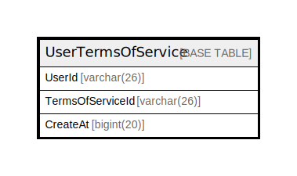

# UserTermsOfService

## 概要

<details>
<summary><strong>テーブル定義</strong></summary>

```sql
CREATE TABLE `UserTermsOfService` (
  `UserId` varchar(26) NOT NULL,
  `TermsOfServiceId` varchar(26) DEFAULT NULL,
  `CreateAt` bigint(20) DEFAULT NULL,
  PRIMARY KEY (`UserId`)
) ENGINE=InnoDB DEFAULT CHARSET=utf8mb4
```

</details>

## カラム一覧

| 名前               | タイプ         | デフォルト値       | NULL許可   | 子テーブル      | 親テーブル      | コメント     |
| ---------------- | ----------- | ------------ | -------- | ---------- | ---------- | -------- |
| UserId           | varchar(26) |              | false    |            |            |          |
| TermsOfServiceId | varchar(26) | NULL         | true     |            |            |          |
| CreateAt         | bigint(20)  | NULL         | true     |            |            |          |

## 制約一覧

| 名前      | タイプ         | 定義                   |
| ------- | ----------- | -------------------- |
| PRIMARY | PRIMARY KEY | PRIMARY KEY (UserId) |

## INDEX一覧

| 名前      | 定義                               |
| ------- | -------------------------------- |
| PRIMARY | PRIMARY KEY (UserId) USING BTREE |

## ER図



---

> Generated by [tbls](https://github.com/k1LoW/tbls)
