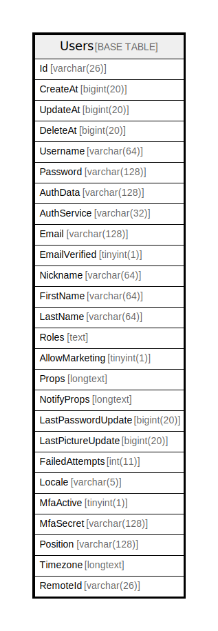

# Users

## 概要

<details>
<summary><strong>テーブル定義</strong></summary>

```sql
CREATE TABLE `Users` (
  `Id` varchar(26) NOT NULL,
  `CreateAt` bigint(20) DEFAULT NULL,
  `UpdateAt` bigint(20) DEFAULT NULL,
  `DeleteAt` bigint(20) DEFAULT NULL,
  `Username` varchar(64) DEFAULT NULL,
  `Password` varchar(128) DEFAULT NULL,
  `AuthData` varchar(128) DEFAULT NULL,
  `AuthService` varchar(32) DEFAULT NULL,
  `Email` varchar(128) DEFAULT NULL,
  `EmailVerified` tinyint(1) DEFAULT NULL,
  `Nickname` varchar(64) DEFAULT NULL,
  `FirstName` varchar(64) DEFAULT NULL,
  `LastName` varchar(64) DEFAULT NULL,
  `Roles` text DEFAULT NULL,
  `AllowMarketing` tinyint(1) DEFAULT NULL,
  `Props` longtext CHARACTER SET utf8mb4 COLLATE utf8mb4_bin DEFAULT NULL CHECK (json_valid(`Props`)),
  `NotifyProps` longtext CHARACTER SET utf8mb4 COLLATE utf8mb4_bin DEFAULT NULL CHECK (json_valid(`NotifyProps`)),
  `LastPasswordUpdate` bigint(20) DEFAULT NULL,
  `LastPictureUpdate` bigint(20) DEFAULT NULL,
  `FailedAttempts` int(11) DEFAULT NULL,
  `Locale` varchar(5) DEFAULT NULL,
  `MfaActive` tinyint(1) DEFAULT NULL,
  `MfaSecret` varchar(128) DEFAULT NULL,
  `Position` varchar(128) DEFAULT NULL,
  `Timezone` longtext CHARACTER SET utf8mb4 COLLATE utf8mb4_bin DEFAULT NULL CHECK (json_valid(`Timezone`)),
  `RemoteId` varchar(26) DEFAULT NULL,
  PRIMARY KEY (`Id`),
  UNIQUE KEY `Username` (`Username`),
  UNIQUE KEY `AuthData` (`AuthData`),
  UNIQUE KEY `Email` (`Email`),
  KEY `idx_users_update_at` (`UpdateAt`),
  KEY `idx_users_create_at` (`CreateAt`),
  KEY `idx_users_delete_at` (`DeleteAt`),
  FULLTEXT KEY `idx_users_all_txt` (`Username`,`FirstName`,`LastName`,`Nickname`,`Email`),
  FULLTEXT KEY `idx_users_all_no_full_name_txt` (`Username`,`Nickname`,`Email`),
  FULLTEXT KEY `idx_users_names_txt` (`Username`,`FirstName`,`LastName`,`Nickname`),
  FULLTEXT KEY `idx_users_names_no_full_name_txt` (`Username`,`Nickname`)
) ENGINE=InnoDB DEFAULT CHARSET=utf8mb4
```

</details>

## カラム一覧

| 名前                 | タイプ          | デフォルト値       | NULL許可   | 子テーブル      | 親テーブル      | コメント     |
| ------------------ | ------------ | ------------ | -------- | ---------- | ---------- | -------- |
| Id                 | varchar(26)  |              | false    |            |            |          |
| CreateAt           | bigint(20)   | NULL         | true     |            |            |          |
| UpdateAt           | bigint(20)   | NULL         | true     |            |            |          |
| DeleteAt           | bigint(20)   | NULL         | true     |            |            |          |
| Username           | varchar(64)  | NULL         | true     |            |            |          |
| Password           | varchar(128) | NULL         | true     |            |            |          |
| AuthData           | varchar(128) | NULL         | true     |            |            |          |
| AuthService        | varchar(32)  | NULL         | true     |            |            |          |
| Email              | varchar(128) | NULL         | true     |            |            |          |
| EmailVerified      | tinyint(1)   | NULL         | true     |            |            |          |
| Nickname           | varchar(64)  | NULL         | true     |            |            |          |
| FirstName          | varchar(64)  | NULL         | true     |            |            |          |
| LastName           | varchar(64)  | NULL         | true     |            |            |          |
| Roles              | text         | NULL         | true     |            |            |          |
| AllowMarketing     | tinyint(1)   | NULL         | true     |            |            |          |
| Props              | longtext     | NULL         | true     |            |            |          |
| NotifyProps        | longtext     | NULL         | true     |            |            |          |
| LastPasswordUpdate | bigint(20)   | NULL         | true     |            |            |          |
| LastPictureUpdate  | bigint(20)   | NULL         | true     |            |            |          |
| FailedAttempts     | int(11)      | NULL         | true     |            |            |          |
| Locale             | varchar(5)   | NULL         | true     |            |            |          |
| MfaActive          | tinyint(1)   | NULL         | true     |            |            |          |
| MfaSecret          | varchar(128) | NULL         | true     |            |            |          |
| Position           | varchar(128) | NULL         | true     |            |            |          |
| Timezone           | longtext     | NULL         | true     |            |            |          |
| RemoteId           | varchar(26)  | NULL         | true     |            |            |          |

## 制約一覧

| 名前       | タイプ         | 定義                             |
| -------- | ----------- | ------------------------------ |
| AuthData | UNIQUE      | UNIQUE KEY AuthData (AuthData) |
| Email    | UNIQUE      | UNIQUE KEY Email (Email)       |
| PRIMARY  | PRIMARY KEY | PRIMARY KEY (Id)               |
| Username | UNIQUE      | UNIQUE KEY Username (Username) |

## INDEX一覧

| 名前                               | 定義                                                                                    |
| -------------------------------- | ------------------------------------------------------------------------------------- |
| idx_users_all_no_full_name_txt   | KEY idx_users_all_no_full_name_txt (Username, Nickname, Email) USING FULLTEXT         |
| idx_users_all_txt                | KEY idx_users_all_txt (Username, FirstName, LastName, Nickname, Email) USING FULLTEXT |
| idx_users_create_at              | KEY idx_users_create_at (CreateAt) USING BTREE                                        |
| idx_users_delete_at              | KEY idx_users_delete_at (DeleteAt) USING BTREE                                        |
| idx_users_names_no_full_name_txt | KEY idx_users_names_no_full_name_txt (Username, Nickname) USING FULLTEXT              |
| idx_users_names_txt              | KEY idx_users_names_txt (Username, FirstName, LastName, Nickname) USING FULLTEXT      |
| idx_users_update_at              | KEY idx_users_update_at (UpdateAt) USING BTREE                                        |
| PRIMARY                          | PRIMARY KEY (Id) USING BTREE                                                          |
| AuthData                         | UNIQUE KEY AuthData (AuthData) USING BTREE                                            |
| Email                            | UNIQUE KEY Email (Email) USING BTREE                                                  |
| Username                         | UNIQUE KEY Username (Username) USING BTREE                                            |

## ER図



---

> Generated by [tbls](https://github.com/k1LoW/tbls)
