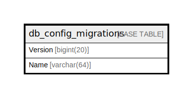

# db_config_migrations

## 概要

<details>
<summary><strong>テーブル定義</strong></summary>

```sql
CREATE TABLE `db_config_migrations` (
  `Version` bigint(20) NOT NULL,
  `Name` varchar(64) NOT NULL,
  PRIMARY KEY (`Version`)
) ENGINE=InnoDB DEFAULT CHARSET=utf8mb4
```

</details>

## カラム一覧

| 名前      | タイプ         | デフォルト値       | NULL許可   | 子テーブル      | 親テーブル      | コメント     |
| ------- | ----------- | ------------ | -------- | ---------- | ---------- | -------- |
| Version | bigint(20)  |              | false    |            |            |          |
| Name    | varchar(64) |              | false    |            |            |          |

## 制約一覧

| 名前      | タイプ         | 定義                    |
| ------- | ----------- | --------------------- |
| PRIMARY | PRIMARY KEY | PRIMARY KEY (Version) |

## INDEX一覧

| 名前      | 定義                                |
| ------- | --------------------------------- |
| PRIMARY | PRIMARY KEY (Version) USING BTREE |

## ER図



---

> Generated by [tbls](https://github.com/k1LoW/tbls)
