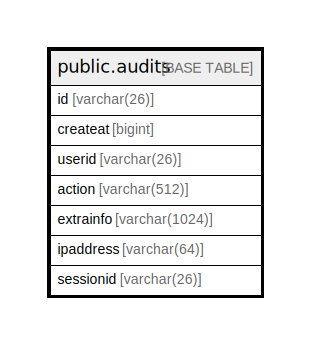

# public.audits

## 概要

## カラム一覧

| 名前        | タイプ           | デフォルト値       | NULL許可   | 子テーブル      | 親テーブル      | コメント     |
| --------- | ------------- | ------------ | -------- | ---------- | ---------- | -------- |
| id        | varchar(26)   |              | false    |            |            |          |
| createat  | bigint        |              | true     |            |            |          |
| userid    | varchar(26)   |              | true     |            |            |          |
| action    | varchar(512)  |              | true     |            |            |          |
| extrainfo | varchar(1024) |              | true     |            |            |          |
| ipaddress | varchar(64)   |              | true     |            |            |          |
| sessionid | varchar(26)   |              | true     |            |            |          |

## 制約一覧

| 名前          | タイプ         | 定義               |
| ----------- | ----------- | ---------------- |
| audits_pkey | PRIMARY KEY | PRIMARY KEY (id) |

## INDEX一覧

| 名前                 | 定義                                                                    |
| ------------------ | --------------------------------------------------------------------- |
| audits_pkey        | CREATE UNIQUE INDEX audits_pkey ON public.audits USING btree (id)     |
| idx_audits_user_id | CREATE INDEX idx_audits_user_id ON public.audits USING btree (userid) |

## ER図

---

> Generated by [tbls](https://github.com/k1LoW/tbls)
