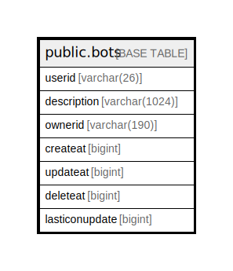

# public.bots

## 概要

## カラム一覧

| 名前             | タイプ           | デフォルト値       | NULL許可   | 子テーブル      | 親テーブル      | コメント     |
| -------------- | ------------- | ------------ | -------- | ---------- | ---------- | -------- |
| userid         | varchar(26)   |              | false    |            |            |          |
| description    | varchar(1024) |              | true     |            |            |          |
| ownerid        | varchar(190)  |              | true     |            |            |          |
| createat       | bigint        |              | true     |            |            |          |
| updateat       | bigint        |              | true     |            |            |          |
| deleteat       | bigint        |              | true     |            |            |          |
| lasticonupdate | bigint        |              | true     |            |            |          |

## 制約一覧

| 名前        | タイプ         | 定義                   |
| --------- | ----------- | -------------------- |
| bots_pkey | PRIMARY KEY | PRIMARY KEY (userid) |

## INDEX一覧

| 名前        | 定義                                                                |
| --------- | ----------------------------------------------------------------- |
| bots_pkey | CREATE UNIQUE INDEX bots_pkey ON public.bots USING btree (userid) |

## ER図

---

> Generated by [tbls](https://github.com/k1LoW/tbls)
