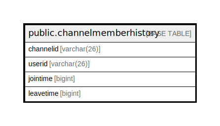

# public.channelmemberhistory

## 概要

## カラム一覧

| 名前        | タイプ         | デフォルト値       | NULL許可   | 子テーブル      | 親テーブル      | コメント     |
| --------- | ----------- | ------------ | -------- | ---------- | ---------- | -------- |
| channelid | varchar(26) |              | false    |            |            |          |
| userid    | varchar(26) |              | false    |            |            |          |
| jointime  | bigint      |              | false    |            |            |          |
| leavetime | bigint      |              | true     |            |            |          |

## 制約一覧

| 名前                        | タイプ         | 定義                                        |
| ------------------------- | ----------- | ----------------------------------------- |
| channelmemberhistory_pkey | PRIMARY KEY | PRIMARY KEY (channelid, userid, jointime) |

## INDEX一覧

| 名前                        | 定義                                                                                                                     |
| ------------------------- | ---------------------------------------------------------------------------------------------------------------------- |
| channelmemberhistory_pkey | CREATE UNIQUE INDEX channelmemberhistory_pkey ON public.channelmemberhistory USING btree (channelid, userid, jointime) |

## ER図

---

> Generated by [tbls](https://github.com/k1LoW/tbls)
