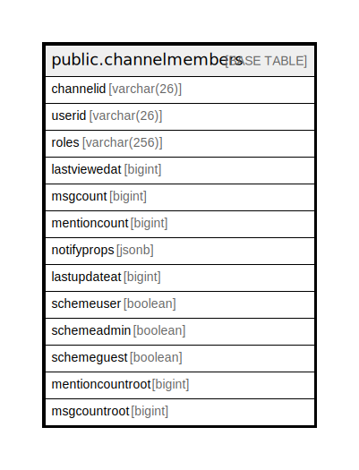

# public.channelmembers

## 概要

## カラム一覧

| 名前               | タイプ          | デフォルト値       | NULL許可   | 子テーブル      | 親テーブル      | コメント     |
| ---------------- | ------------ | ------------ | -------- | ---------- | ---------- | -------- |
| channelid        | varchar(26)  |              | false    |            |            |          |
| userid           | varchar(26)  |              | false    |            |            |          |
| roles            | varchar(256) |              | true     |            |            |          |
| lastviewedat     | bigint       |              | true     |            |            |          |
| msgcount         | bigint       |              | true     |            |            |          |
| mentioncount     | bigint       |              | true     |            |            |          |
| notifyprops      | jsonb        |              | true     |            |            |          |
| lastupdateat     | bigint       |              | true     |            |            |          |
| schemeuser       | boolean      |              | true     |            |            |          |
| schemeadmin      | boolean      |              | true     |            |            |          |
| schemeguest      | boolean      |              | true     |            |            |          |
| mentioncountroot | bigint       |              | true     |            |            |          |
| msgcountroot     | bigint       |              | true     |            |            |          |

## 制約一覧

| 名前                  | タイプ         | 定義                              |
| ------------------- | ----------- | ------------------------------- |
| channelmembers_pkey | PRIMARY KEY | PRIMARY KEY (channelid, userid) |

## INDEX一覧

| 名前                                                   | 定義                                                                                                                                       |
| ---------------------------------------------------- | ---------------------------------------------------------------------------------------------------------------------------------------- |
| channelmembers_pkey                                  | CREATE UNIQUE INDEX channelmembers_pkey ON public.channelmembers USING btree (channelid, userid)                                         |
| idx_channelmembers_user_id_channel_id_last_viewed_at | CREATE INDEX idx_channelmembers_user_id_channel_id_last_viewed_at ON public.channelmembers USING btree (userid, channelid, lastviewedat) |
| idx_channelmembers_channel_id_scheme_guest_user_id   | CREATE INDEX idx_channelmembers_channel_id_scheme_guest_user_id ON public.channelmembers USING btree (channelid, schemeguest, userid)    |

## ER図

---

> Generated by [tbls](https://github.com/k1LoW/tbls)
