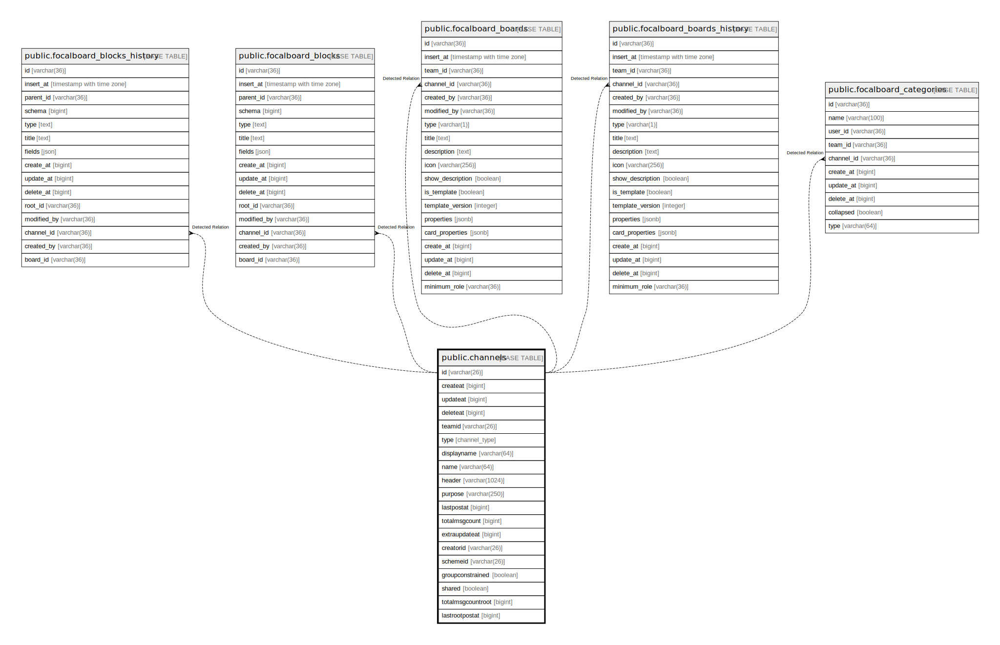

# public.channels

## 概要

## カラム一覧

| 名前                | タイプ           | デフォルト値       | NULL許可   | 子テーブル                                                                                                                                                                                                                                                                                                                           | 親テーブル      | コメント     |
| ----------------- | ------------- | ------------ | -------- | ------------------------------------------------------------------------------------------------------------------------------------------------------------------------------------------------------------------------------------------------------------------------------------------------------------------------------- | ---------- | -------- |
| id                | varchar(26)   |              | false    | [public.focalboard_blocks_history](public.focalboard_blocks_history.md) [public.focalboard_blocks](public.focalboard_blocks.md) [public.focalboard_boards](public.focalboard_boards.md) [public.focalboard_boards_history](public.focalboard_boards_history.md) [public.focalboard_categories](public.focalboard_categories.md) |            |          |
| createat          | bigint        |              | true     |                                                                                                                                                                                                                                                                                                                                 |            |          |
| updateat          | bigint        |              | true     |                                                                                                                                                                                                                                                                                                                                 |            |          |
| deleteat          | bigint        |              | true     |                                                                                                                                                                                                                                                                                                                                 |            |          |
| teamid            | varchar(26)   |              | true     |                                                                                                                                                                                                                                                                                                                                 |            |          |
| type              | channel_type  |              | true     |                                                                                                                                                                                                                                                                                                                                 |            |          |
| displayname       | varchar(64)   |              | true     |                                                                                                                                                                                                                                                                                                                                 |            |          |
| name              | varchar(64)   |              | true     |                                                                                                                                                                                                                                                                                                                                 |            |          |
| header            | varchar(1024) |              | true     |                                                                                                                                                                                                                                                                                                                                 |            |          |
| purpose           | varchar(250)  |              | true     |                                                                                                                                                                                                                                                                                                                                 |            |          |
| lastpostat        | bigint        |              | true     |                                                                                                                                                                                                                                                                                                                                 |            |          |
| totalmsgcount     | bigint        |              | true     |                                                                                                                                                                                                                                                                                                                                 |            |          |
| extraupdateat     | bigint        |              | true     |                                                                                                                                                                                                                                                                                                                                 |            |          |
| creatorid         | varchar(26)   |              | true     |                                                                                                                                                                                                                                                                                                                                 |            |          |
| schemeid          | varchar(26)   |              | true     |                                                                                                                                                                                                                                                                                                                                 |            |          |
| groupconstrained  | boolean       |              | true     |                                                                                                                                                                                                                                                                                                                                 |            |          |
| shared            | boolean       |              | true     |                                                                                                                                                                                                                                                                                                                                 |            |          |
| totalmsgcountroot | bigint        |              | true     |                                                                                                                                                                                                                                                                                                                                 |            |          |
| lastrootpostat    | bigint        | '0'::bigint  | true     |                                                                                                                                                                                                                                                                                                                                 |            |          |

## 制約一覧

| 名前                       | タイプ         | 定義                    |
| ------------------------ | ----------- | --------------------- |
| channels_pkey            | PRIMARY KEY | PRIMARY KEY (id)      |
| channels_name_teamid_key | UNIQUE      | UNIQUE (name, teamid) |

## INDEX一覧

| 名前                                | 定義                                                                                                                                                                                             |
| --------------------------------- | ---------------------------------------------------------------------------------------------------------------------------------------------------------------------------------------------- |
| channels_pkey                     | CREATE UNIQUE INDEX channels_pkey ON public.channels USING btree (id)                                                                                                                          |
| channels_name_teamid_key          | CREATE UNIQUE INDEX channels_name_teamid_key ON public.channels USING btree (name, teamid)                                                                                                     |
| idx_channels_displayname_lower    | CREATE INDEX idx_channels_displayname_lower ON public.channels USING btree (lower((displayname)::text))                                                                                        |
| idx_channels_name_lower           | CREATE INDEX idx_channels_name_lower ON public.channels USING btree (lower((name)::text))                                                                                                      |
| idx_channels_update_at            | CREATE INDEX idx_channels_update_at ON public.channels USING btree (updateat)                                                                                                                  |
| idx_channels_delete_at            | CREATE INDEX idx_channels_delete_at ON public.channels USING btree (deleteat)                                                                                                                  |
| idx_channels_create_at            | CREATE INDEX idx_channels_create_at ON public.channels USING btree (createat)                                                                                                                  |
| idx_channel_search_txt            | CREATE INDEX idx_channel_search_txt ON public.channels USING gin (to_tsvector('english'::regconfig, (((((name)::text || ' '::text) || (displayname)::text) || ' '::text) || (purpose)::text))) |
| idx_channels_scheme_id            | CREATE INDEX idx_channels_scheme_id ON public.channels USING btree (schemeid)                                                                                                                  |
| idx_channels_team_id_display_name | CREATE INDEX idx_channels_team_id_display_name ON public.channels USING btree (teamid, displayname)                                                                                            |
| idx_channels_team_id_type         | CREATE INDEX idx_channels_team_id_type ON public.channels USING btree (teamid, type)                                                                                                           |

## ER図

---

> Generated by [tbls](https://github.com/k1LoW/tbls)
