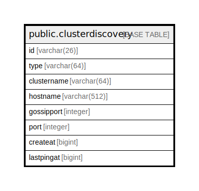

# public.clusterdiscovery

## 概要

## カラム一覧

| 名前          | タイプ          | デフォルト値       | NULL許可   | 子テーブル      | 親テーブル      | コメント     |
| ----------- | ------------ | ------------ | -------- | ---------- | ---------- | -------- |
| id          | varchar(26)  |              | false    |            |            |          |
| type        | varchar(64)  |              | true     |            |            |          |
| clustername | varchar(64)  |              | true     |            |            |          |
| hostname    | varchar(512) |              | true     |            |            |          |
| gossipport  | integer      |              | true     |            |            |          |
| port        | integer      |              | true     |            |            |          |
| createat    | bigint       |              | true     |            |            |          |
| lastpingat  | bigint       |              | true     |            |            |          |

## 制約一覧

| 名前                    | タイプ         | 定義               |
| --------------------- | ----------- | ---------------- |
| clusterdiscovery_pkey | PRIMARY KEY | PRIMARY KEY (id) |

## INDEX一覧

| 名前                    | 定義                                                                                    |
| --------------------- | ------------------------------------------------------------------------------------- |
| clusterdiscovery_pkey | CREATE UNIQUE INDEX clusterdiscovery_pkey ON public.clusterdiscovery USING btree (id) |

## ER図

---

> Generated by [tbls](https://github.com/k1LoW/tbls)
