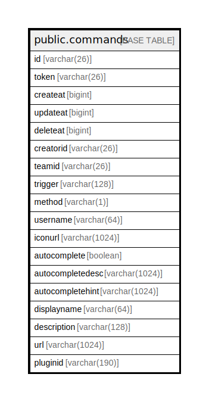

# public.commands

## 概要

## カラム一覧

| 名前               | タイプ           | デフォルト値       | NULL許可   | 子テーブル      | 親テーブル      | コメント     |
| ---------------- | ------------- | ------------ | -------- | ---------- | ---------- | -------- |
| id               | varchar(26)   |              | false    |            |            |          |
| token            | varchar(26)   |              | true     |            |            |          |
| createat         | bigint        |              | true     |            |            |          |
| updateat         | bigint        |              | true     |            |            |          |
| deleteat         | bigint        |              | true     |            |            |          |
| creatorid        | varchar(26)   |              | true     |            |            |          |
| teamid           | varchar(26)   |              | true     |            |            |          |
| trigger          | varchar(128)  |              | true     |            |            |          |
| method           | varchar(1)    |              | true     |            |            |          |
| username         | varchar(64)   |              | true     |            |            |          |
| iconurl          | varchar(1024) |              | true     |            |            |          |
| autocomplete     | boolean       |              | true     |            |            |          |
| autocompletedesc | varchar(1024) |              | true     |            |            |          |
| autocompletehint | varchar(1024) |              | true     |            |            |          |
| displayname      | varchar(64)   |              | true     |            |            |          |
| description      | varchar(128)  |              | true     |            |            |          |
| url              | varchar(1024) |              | true     |            |            |          |
| pluginid         | varchar(190)  |              | true     |            |            |          |

## 制約一覧

| 名前            | タイプ         | 定義               |
| ------------- | ----------- | ---------------- |
| commands_pkey | PRIMARY KEY | PRIMARY KEY (id) |

## INDEX一覧

| 名前                    | 定義                                                                           |
| --------------------- | ---------------------------------------------------------------------------- |
| commands_pkey         | CREATE UNIQUE INDEX commands_pkey ON public.commands USING btree (id)        |
| idx_command_team_id   | CREATE INDEX idx_command_team_id ON public.commands USING btree (teamid)     |
| idx_command_update_at | CREATE INDEX idx_command_update_at ON public.commands USING btree (updateat) |
| idx_command_create_at | CREATE INDEX idx_command_create_at ON public.commands USING btree (createat) |
| idx_command_delete_at | CREATE INDEX idx_command_delete_at ON public.commands USING btree (deleteat) |

## ER図

---

> Generated by [tbls](https://github.com/k1LoW/tbls)
